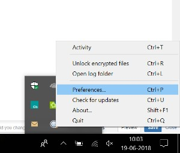

# Acelere os downloads do Brand Portal {#guide-to-accelerate-downloads-from-brand-portal}

<!-- This topic is woefully out of date. It talks at length about using a third party application whose URLs have a variety of problems. Topic should either be deleted or updated entirely to not talk about a specific third party application that Adobe has no control over. It also appears that the third party app is NOT free anymore. -->

O Adobe Experience Manager Assets Brand Portal permite melhorar o desempenho de download de arquivos de ativos grandes ao integrar com o IBM® Aspera Connect, que é um aplicativo de instalação sob demanda. O aplicativo usa tecnologia proprietária para remover as despesas gerais de TCP e ajuda a melhorar a velocidade de transferência dos arquivos de ativos. Essa integração garante uma experiência aprimorada de download.

>[!NOTE]
>
>A velocidade de download varia para os usuários porque depende de fatores como largura de banda da rede, latência do servidor e a localização geográfica dos clientes.

Por padrão, a configuração **[!UICONTROL Download Rápido]** está habilitada, o que reduz significativamente o tempo necessário para baixar os arquivos de ativos desejados do Brand Portal.

## Pré-requisitos para acelerar o download de arquivos {#prerequisites-to-accelerate-file-download}

Para baixar os arquivos mais rapidamente, verifique o seguinte:

* Navegue até **[!UICONTROL Ferramentas]** > **[!UICONTROL Download]** e verifique se a configuração **[!UICONTROL Download Rápido]** está habilitada em **[!UICONTROL Configurações de Download]**.
* Verifique se a porta 33001 (TCP e UDP) está aberta no firewall.
* **Instale o IBM® Aspera Connect 3.9.9** na extensão do seu navegador usando privilégios de administrador ([Downloads do IBM® Aspera Connect](https://www.ibm.com/support/fixcentral/swg/selectFixes?parent=ibm%7EOther%20software&amp;product=ibm/Other+software/IBM+Aspera+Connect&amp;release=3.9.9&amp;platform=All&amp;function=all)).

>[!NOTE]
>
>Há um problema conhecido com o IBM® Aspera Connect. O download rápido não funciona com o IBM® Aspera Connect versão 3.10 e superior.

## Baixar domínios {#download-domains}

A seguir estão os domínios de download para regiões diferentes:

| Código da região | Domínio |
|---|---|
| NA OU1 | downloads-na1.brand-portal.adobe.com |
| NA VA5 | downloads-na2.brand-portal.adobe.com |
| EMEA LON5 | downloads-emea1.brand-portal.adobe.com |
| APAC SIN2 | downloads-apac1.brand-portal.adobe.com |

## Desempenho de download de amostra usando o acelerador de arquivos {#expected-download-performance-using-file-accelerator}

A tabela a seguir mostra o desempenho de download de um arquivo de 2 GB usando o acelerador de download de arquivo Aspera Connect:

*Os resultados observados variam devido a fatores como largura de banda da rede, latência do servidor e localização do cliente, considerando que o servidor Brand Portal está em Oregon (Estados Unidos).*

| Local do cliente | Latência entre cliente e servidor (milissegundos) | Velocidade com o acelerador de transferência de arquivos Aspera Connect (MBps) | Tempo necessário para baixar um arquivo de 2 GB com o Aspera File Transfer Accelerator (segundos) |
|---------------------------|-----------------------------------|---------------------------------------------|-------------------------------------------------------------------------|
| Oeste dos EUA (N. Califórnia) | 18 | 36 | 57 |
| Oeste dos EUA (Oregon) | 42 | 36 | 57 |
| Leste dos EUA (N. Virgínia) | 85 | 35 | 58 |
| APAC (Tóquio) | 124 | 36 | 57 |
| Noida (Índia) | 275 | 13,36 | 153 |
| Sydney | 175 | 29 | 70 |
| Londres | 179 | 35 | 58 |
| Singapura | 196 | 34 | 60 |

## Baixar ativos {#download-assets}

Para baixar ativos mais rapidamente da Brand Portal:

1. Faça logon no seu locatário do Brand Portal. Por padrão, a exibição **[!UICONTROL Arquivos]** é aberta, contendo todos os ativos e pastas publicados.

   Siga uma das seguintes opções:

   * Selecione os ativos ou pastas que deseja baixar. Na barra de ferramentas na parte superior, clique no ícone **[!UICONTROL Download]**.

     

   * Para baixar representações de ativos específicas de um ativo, passe o ponteiro sobre o ativo e clique no ícone **[!UICONTROL Download]** disponível nas miniaturas de ação rápida.

     

1. A caixa de diálogo **[!UICONTROL Download]** listando todos os ativos selecionados é aberta.

   Para preservar a hierarquia de pastas do Brand Portal ao baixar ativos, marque a caixa de seleção **[!UICONTROL `Create separate folder for each asset`]**.

   O botão de download reflete a contagem dos itens selecionados. Quando terminar de aplicar as regras, clique em **[!UICONTROL Baixar itens]**. Para saber mais sobre como aplicar as regras, consulte [baixar ativos](../using/brand-portal-download-assets.md#download-assets).

   

1. Por padrão, a configuração **[!UICONTROL Download Rápido]** está habilitada nas **[!UICONTROL Configurações de Download]**. Portanto, aparece uma caixa de confirmação para fazer o download de ativos usando o IBM® Aspera Connect.

   Se você fez o download de ativos pela primeira vez e não tem o IBM® Aspera Connect instalado no navegador, você será solicitado a instalá-lo. Se a versão existente estiver desatualizada, você também será solicitado a instalar o [Acelerador de download Aspera](https://www.ibm.com/support/fixcentral/swg/selectFixes?parent=ibm%7EOther%20software&amp;product=ibm/Other+software/IBM+Aspera+Connect&amp;release=3.9.9&amp;platform=All&amp;function=all).

   

1. **Instalar Cliente Aspera Connect**

   Para instalar a configuração do cliente IBM® Aspera Connect, execute a configuração do arquivo .msi do aplicativo cliente IBM® Aspera Connect e siga o assistente de instalação.

   

1. Depois que o cliente for instalado com sucesso, atualize a página do navegador e inicie as etapas de download novamente.

1. Para continuar usando o **[!UICONTROL Download Rápido]**, clique em **[!UICONTROL Permitir]**. Todas as representações selecionadas são baixadas em uma pasta zip usando o IBM® Aspera Connect.

   Após a conclusão bem-sucedida do download, uma caixa de diálogo mostra o local onde os ativos são baixados no sistema do usuário.

   

   Se não quiser usar o IBM® Aspera Connect, clique em **[!UICONTROL Negar]**. Se o **[!UICONTROL Download Rápido]** for negado ou falhar, o sistema preencherá uma mensagem de Erro. Clique no botão **[!UICONTROL Download Normal]** para continuar baixando os ativos.

>[!NOTE]
>
>Se a configuração **[!UICONTROL Download Rápido]** for desativada pelo administrador, as representações selecionadas serão baixadas diretamente em uma pasta zip sem usar o IBM® Aspera Connect.

<!-- 
On successful completion of the download, a dialog box shows the location where assets are downloaded onto the user's system. If there is a failure, it shows error.

   >[!NOTE]
   >
   >There is a known limitation in Aspera Connect client application that no prompt to select download location appears if **[!UICONTROL Always ask me where to save downloaded files]** is enabled under the tab **[!UICONTROL Transfers]** within **[!UICONTROL Preferences]**. Before any download begins, provide the location in the text box **[!UICONTROL Save downloaded files to]**.

1. Log in to Brand Portal using a supported browser.
1. Browse and select the folders or assets you want to download. From the toolbar at the top, click the **[!UICONTROL Download]** icon. the **[!UICONTROL Download]** dialog appears with the **[!UICONTROL Asset(s)]** and **[!UICONTROL Enable download acceleration]** check boxes selected by default. 

   

   >[!NOTE]
   >
   >The functionality to send email notification with the link to download assets is presently not supported while faster downloads are enabled.

   

1. Click **[!UICONTROL Download]**.

   To speed up the download experience on your Brand Portal tenant account, you need to have Aspera Connect client application installed in your browser's extension.

1. **Download Aspera Connect Client**

   If Aspera Connect client is not installed on your system or the existing Aspera Connect client is out of date, a prompt is displayed on the browser page from where you can download the system-specific Aspera Connect client by selecting **[!UICONTROL Download Latest Version]**.

   

   To download the latest version of Aspera Connect from [https://downloads.asperasoft.com/connect2/](https://downloads.asperasoft.com/connect2/), select **[!UICONTROL Download Now]** and follow the instructions.

1. **Install Aspera Connect Client**

   To install IBM Aspera Connect client setup, run the setup from  .msi  file of IBM Aspera Connect client application and follow the installation wizard.

1. Once the client is successfully installed, refresh the browser page and initiate the download steps again.

   When using Aspera Connect for the first time, the browser prompts to open the link using **[!UICONTROL IBM Aspera Connect]**. To skip this dialog in future, enable **[!UICONTROL Remember my choice for FASP links]**.

   >[!NOTE]
   >
   >This message is different on the different browsers.

1. A dialog box confirms whether to proceed the transfer or not. Select **[!UICONTROL Allow]** to begin.
To skip this dialog in future, enable **[!UICONTROL Use my choice for all connections with this host]**.
Download begins. A dialog box shows the progress of the download. Use the dialog box to **[!UICONTROL pause]**, **[!UICONTROL resume]**, or **[!UICONTROL cancel]** the download.
Aspera Connect application provides an Activity Window on the system where user can view and manage all transfer sessions. For more information, refer [Aspera Connect Client documentation](https://downloads.asperasoft.com/en/documentation/8).

On successful completion of the download, a dialog box shows the location where assets are downloaded onto the user's system. If there is a failure, it shows error.

   >[!NOTE]
   >
   >There is a known limitation in Aspera Connect client application that no prompt to select download location appears if **[!UICONTROL Always ask me where to save downloaded files]** is enabled under the tab **[!UICONTROL Transfers]** within **[!UICONTROL Preferences]**. Before any download begins, provide the location in the text box **[!UICONTROL Save downloaded files to]**.
-->

## Uso do acelerador de arquivos no navegador Microsoft® Edge {#using-file-accelerator-on-microsoft-edge-browser}

O Microsoft® Edge é executado no Modo Protegido Aprimorado (EPM), impedindo a comunicação com o servidor Aspera Connect, enquanto está na mesma rede privada ou com um Site Confiável. Portanto, um pop-up é exibido sempre que uma conexão com o servidor é estabelecida.

Para usar a funcionalidade de download acelerado no Microsoft® Edge, remova o site da Brand Portal da lista Site confiável.

1. Abra o Painel de Controle (**[!UICONTROL Tecla Window + X]** e selecione **[!UICONTROL Painel de Controle]**).
1. Ir para **[!UICONTROL Rede e Internet]** > **[!UICONTROL Opções da Internet]**. Clique na guia **[!UICONTROL Segurança]**.
1. Clique na **[!UICONTROL zona de sites confiáveis]** e em **[!UICONTROL Sites]**.
1. Remova o site do Brand Portal da lista.

## Preferências de cliente do Aspera Connect {#aspera-connect-client-preferences}

Algumas preferências úteis podem ser definidas na preferência do cliente IBM® Aspera Connect clicando com o botão direito do mouse no ícone e selecionando **[!UICONTROL Preferências]**.

Você pode definir o local de download padrão.

Além disso, o cliente Aspera Connect pode ser marcado para que seja iniciado automaticamente na inicialização do sistema. E o cliente Connect é executado e está disponível para que o download comece mais rápido.

## Solucionar problemas com aceleração de download {#troubleshoot-issues-with-download-acceleration}

Se a aceleração de download não estiver funcionando para você, tente as seguintes sugestões:

1. Verifique se as portas não estão bloqueadas. Use o Google Search para encontrar opções que permitem verificar se as portas estão bloqueadas, com base no sistema operacional usado.  <!-- THIS URL IS 404 AND DOES NOT REDIRECT [https://test-connect.asperasoft.com](https://test-connect.asperasoft.com/) from your computer. -->

   Se as portas não estiverem OK, entre em contato com a equipe de rede e verifique se as Portas 33001 (TCP e UDP) não estão bloqueadas no firewall.

1. Se as portas estiverem OK, verifique se a rede não está lenta medindo a largura de banda disponível usando [https://www.speedtest.net/](https://www.speedtest.net/).

   Se a largura de banda for de poucos (1-10 Mbps) ou em Kbps, use as Preferências Aspera e tente limitar a largura de banda igual à disponível.

   <!-- The URL in this step is giving a 404 error. 1. To confirm whether the downloads from Aspera demo server are working, use [https://demo.asperasoft.com/aspera/user](https://demo.asperasoft.com/aspera/user).  
   (login:  asperaweb , password:  demoaspera ) -->

1. Se nenhuma das etapas de solução de problemas acima funcionar, desmarque a opção Ativar aceleração de download e use o download normal.
