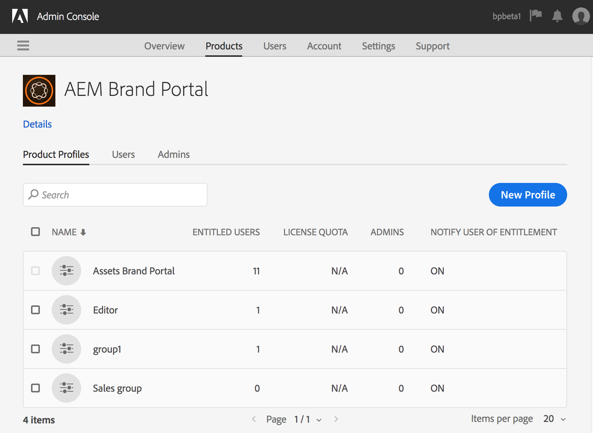
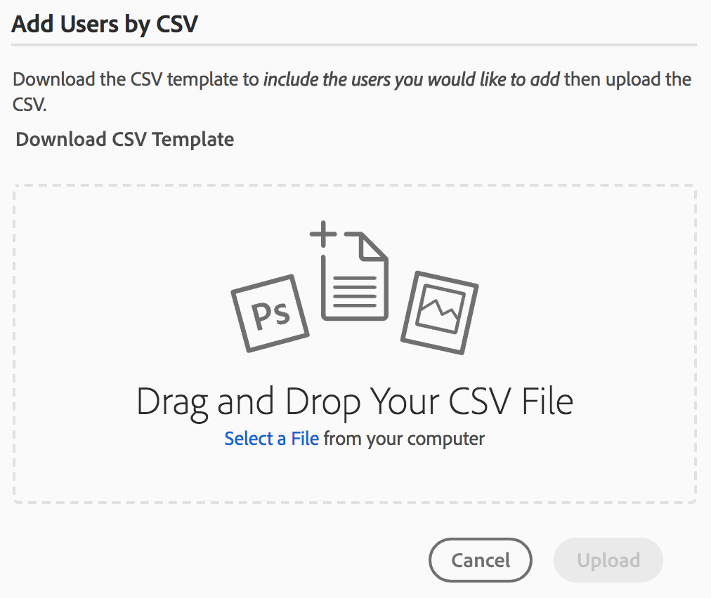

# Gerenciar usuários, grupos e funções de usuário {#manage-users-groups-and-user-roles}

Os administradores podem usar o Adobe Admin Console para criar usuários e perfis de produto do Experience Manager Assets Brand Portal e gerenciar suas funções usando a interface do usuário do Brand Portal. Esse privilégio não está disponível para Visualizadores e Editores.

Em [[!UICONTROL Admin Console]](https://adminconsole.adobe.com/enterprise/overview), você pode exibir todos os produtos associados à sua organização. Um produto pode ser qualquer solução de Experience Cloud, como Adobe Analytics, Adobe Target ou Experience Manager Assets Brand Portal. Escolha o produto AEM Brand Portal e crie Perfis de produto.

<!--
Comment Type: draft

<note type="note">

Product profiles (formerly known as product configurations*). 

* The nomenclature has changed from product configurations to Product Profiles in the new Adobe Admin Console.

</note>
-->

Esses Perfis de produto são sincronizados com a interface do usuário do Brand Portal a cada 8 horas e visíveis como grupos no Brand Portal. Depois de adicionar usuários e criar Perfis de produto, e adicionar usuários a esses Perfis de produto, você pode atribuir funções a usuários e grupos no Brand Portal.

>[!NOTE]
>
>Para criar grupos no Brand Portal, a partir do Adobe [!UICONTROL Admin Console], use **[!UICONTROL Produtos > Perfis de produto]**, em vez da **[!UICONTROL página Usuário > Grupos de usuários]**. Os perfis de produto no Adobe [!UICONTROL Admin Console] são usados para criar grupos no Brand Portal.

## Adicionar um usuário {#add-a-user}

Se você for um Administrador de Produto, use o Adobe [[!UICONTROL Admin Console]](https://adminconsole.adobe.com/enterprise/overview) para criar usuários e atribuí-los a Perfis de Produto (*conhecidos anteriormente como configurações de produto*), que são exibidos como grupos no Brand Portal. Você pode usar grupos para executar operações em massa, como gerenciamento de funções e compartilhamento de ativos.

>[!NOTE]
>
>Os novos usuários que não têm acesso ao Brand Portal podem solicitar acesso na tela de logon do Brand Portal. Para obter mais informações, consulte [Solicitar acesso ao Brand Portal](../using/brand-portal.md#request-access-to-brand-portal). Depois de receber notificações de solicitação de acesso na área de notificações, clique na notificação relevante e em **[!UICONTROL Conceder acesso]**. Como alternativa, siga o link no email de solicitação de acesso recebido. Em seguida, para adicionar um usuário por meio do [Adobe [!UICONTROL Admin Console]](https://adminconsole.adobe.com/enterprise/overview), siga as Etapas 4 a 7 no procedimento abaixo.

>[!NOTE]
>
>Você pode fazer logon no [Adobe [!UICONTROL Admin Console]](https://adminconsole.adobe.com/enterprise/overview) diretamente ou pelo Brand Portal. Se você fizer logon diretamente, siga as etapas 4 a 7 abaixo para adicionar um usuário.

1. Na barra de ferramentas do AEM na parte superior, clique no logotipo Adobe para acessar as ferramentas administrativas.

   

1. No painel de ferramentas administrativas, clique em **[!UICONTROL Usuários]**.

   

1. Na página [!UICONTROL Funções do usuário], clique na guia **[!UICONTROL Gerenciamento]** e em **[!UICONTROL Iniciar Admin Console]**.

   

1. No Admin Console, execute um dos procedimentos a seguir para criar um novo usuário:

   * Na barra de ferramentas na parte superior, clique em **[!UICONTROL Visão geral]**. Na página [!UICONTROL Visão geral], clique em **[!UICONTROL Atribuir usuários]** no cartão de produto do Brand Portal.

   

   * Na barra de ferramentas na parte superior, clique em **[!UICONTROL Usuários]**. Na página [!UICONTROL Usuários], [!UICONTROL Usuários] no painel esquerdo são selecionados por padrão. Clique em **[!UICONTROL Adicionar usuário]**.

   

1. Na caixa de diálogo Adicionar usuário, digite a ID de email do usuário que deseja adicionar ou selecione o usuário na lista de sugestões que aparecem ao digitar.

   

1. Atribua o usuário a pelo menos um perfil de produto (conhecido anteriormente como configurações de produto) para que ele possa acessar o Brand Portal. Selecione o perfil de produto apropriado no campo **[!UICONTROL Selecione um perfil para este produto]**.
1. Clique em **[!UICONTROL Salvar]**. Um email de boas-vindas é enviado ao usuário recém-adicionado. O usuário convidado pode clicar no link do email de boas-vindas para acessar o Brand Portal. O usuário pode fazer logon usando a ID de email ([!UICONTROL Adobe ID], [!UICONTROL Enterprise ID] ou [!UICONTROL Federated ID]) configurada no Admin Console. Para obter mais informações, consulte [Experiência de login pela primeira vez](../using/brand-portal-onboarding.md).

   >[!NOTE]
   >
   >Se um usuário não conseguir fazer logon no Brand Portal, o administrador da organização deverá visitar o Adobe [!UICONTROL Admin Console]. Verifique se o usuário está presente e se foi adicionado a pelo menos um perfil de produto.

   Para obter informações sobre como conceder privilégios administrativos ao usuário, consulte [Fornecer privilégios de administrador aos usuários](../using/brand-portal-adding-users.md#provideadministratorprivilegestousers).

## Adicionar um perfil de produto {#add-a-product-profile}

Os perfis de produto (conhecidos formalmente como configurações de produto) em [!UICONTROL Admin Console] são usados para criar grupos no Brand Portal para que você possa realizar operações em massa, como gerenciamento de funções e compartilhamento de ativos no Brand Portal. O **Brand Portal** é o perfil de produto padrão disponível; você pode criar mais Perfis de Produto e adicionar usuários aos novos Perfis de Produto.

>[!NOTE]
>
>Você pode fazer logon no [[!UICONTROL Admin Console]](https://adminconsole.adobe.com/enterprise/overview) diretamente ou pelo Brand Portal. Se você fizer logon diretamente no [!UICONTROL Admin Console], siga as etapas 4 a 7 do procedimento abaixo para adicionar um perfil de produto.

1. Na barra de ferramentas do AEM na parte superior, clique no logotipo Adobe para acessar as ferramentas administrativas.

   

1. No painel de ferramentas administrativas, clique em **[!UICONTROL Usuários]**.

   

1. Na página [!UICONTROL Funções do usuário], clique na guia **[!UICONTROL Gerenciamento]** e em **[!UICONTROL Iniciar Admin Console]**.

   

1. Na barra de ferramentas na parte superior, clique em **[!UICONTROL Produtos]**.
1. Na página [!UICONTROL Produtos], [!UICONTROL Perfis de Produtos] são selecionados por padrão. Clique em **[!UICONTROL Novo Perfil]**.

   

1. Na página [!UICONTROL Criar um Novo Perfil], forneça o nome do perfil, o nome para exibição e a descrição do perfil. Escolha que os usuários sejam notificados por email quando forem adicionados ou removidos do perfil.

   

1. Clique em **[!UICONTROL Concluído]**. O grupo de configuração do produto. Por exemplo, o **[!UICONTROL Grupo de vendas]** foi adicionado ao Brand Portal.

   

## Adicionar usuários a um perfil de produto {#add-users-to-a-product-profile}

Para adicionar usuários a um grupo Brand Portal, adicione-os ao perfil de produto correspondente (conhecido anteriormente como configurações de produto) no [!UICONTROL Admin Console]. Você pode adicionar usuários individualmente ou em massa.

>[!NOTE]
>
>Você pode fazer logon no [[!UICONTROL Admin Console]](https://adminconsole.adobe.com/enterprise/overview) diretamente ou pelo Brand Portal. Se você fizer logon diretamente no Admin Console, siga as etapas 4 a 7 do procedimento abaixo para adicionar usuários a um perfil de produto.

1. Na barra de ferramentas na parte superior, clique no logotipo do Experience Manager para acessar as ferramentas administrativas.

   

1. No painel de ferramentas administrativas, clique em **[!UICONTROL Usuários]**.

   

1. Na página [!UICONTROL Funções do usuário], clique na guia **[!UICONTROL Gerenciamento]** e em **[!UICONTROL Iniciar Admin Console]**.

   ![Iniciar [!DNL Admin Console]](assets/launch_admin_console.png)

1. Na barra de ferramentas na parte superior, clique em **[!UICONTROL Produtos]**.
1. Na página [!UICONTROL Produtos], [!UICONTROL Perfis de Produtos] são selecionados por padrão. Abra o perfil de produto ao qual deseja adicionar um usuário, por exemplo, [!UICONTROL Grupo de vendas].

   

1. Para adicionar usuários individuais ao perfil de produto, faça o seguinte:

   * Clique em **[!UICONTROL Adicionar usuário]**.

   

   * Na página [!UICONTROL Adicionar Usuário ao Grupo de Vendas], digite a ID de email do usuário que deseja adicionar ou selecione-o na lista de sugestões que aparecem ao digitar.

   

   * Clique em **[!UICONTROL Salvar]**.

1. Para adicionar usuários em massa ao perfil do produto, faça o seguinte:

   * Escolha **[!UICONTROL reticências (...) > Adicionar usuários por CSV]**.

   

   * Na página **[!UICONTROL Adicionar usuários ao CSV]**, baixe um modelo CSV ou arraste e solte um arquivo CSV.

   

   * Clique em **[!UICONTROL Fazer upload]**.

   Quando você adiciona usuários ao perfil de produto padrão, o Brand Portal, o sistema envia um email de boas-vindas para suas IDs de email. Os usuários convidados poderão acessar o Brand Portal clicando no link do email de boas-vindas e entrando com a [!UICONTROL Adobe ID]. Consulte [Experiência de login pela primeira vez](../using/brand-portal-onboarding.md).

   Os usuários adicionados a um perfil personalizado ou a um novo perfil de produto não recebem notificações por email.

## Fornecer privilégios de administrador aos usuários {#provide-administrator-privileges-to-users}

Você pode conceder privilégios de Administrador do sistema ou de Administrador do produto a um usuário do Brand Portal. No entanto, evite atribuir outras funções administrativas disponíveis no [!UICONTROL Admin Console]. Por exemplo, administrador de perfil de produto, administrador de grupo de usuários e administrador de suporte. Consulte [Funções administrativas](https://helpx.adobe.com/enterprise/using/admin-roles.html).

>[!NOTE]
>
>Você pode fazer logon no [[!UICONTROL Admin Console]](https://adminconsole.adobe.com/enterprise/overview) diretamente ou pelo Brand Portal. Se você fizer logon diretamente no [!UICONTROL Admin Console], siga as etapas 4 a 8 do procedimento abaixo para adicionar um usuário a um perfil de produto.

1. Na barra de ferramentas do AEM na parte superior, clique no logotipo Adobe para acessar as ferramentas administrativas.

   

1. No painel de ferramentas administrativas, clique em **[!UICONTROL Usuários]**.

   

1. Na página [!UICONTROL Funções do usuário], clique na guia **[!UICONTROL Gerenciamento]** e em **[!UICONTROL Iniciar Admin Console]**.

   

1. Na barra de ferramentas na parte superior, clique em **[!UICONTROL Usuários]**.
1. Na página [!UICONTROL Usuários], no painel esquerdo, os [!UICONTROL Usuários] são selecionados por padrão. Clique no nome do usuário ao qual você deseja fornecer privilégios de administrador.

   

1. Na página de perfil do usuário, localize a seção **[!UICONTROL Direitos Administrativos]** na parte inferior e escolha **[!UICONTROL reticências (...) > Editar direitos administrativos]**.
   

1. Na página [!UICONTROL Editar Administrador], selecione Administrador do Sistema ou Administrador do Produto.

   

   >[!NOTE]
   >
   >O Brand Portal oferece suporte somente às funções de Administrador do sistema e Administrador do produto.
   >
   >A Adobe recomenda que você evite usar a função de Administrador do sistema, pois ela concede privilégios de administrador em toda a organização para todos os produtos de uma organização. Por exemplo, um Administrador de sistema de uma organização que inclui três produtos em nuvem para marketing tem todo o conjunto de privilégios para os três produtos. Somente um administrador do sistema pode configurar o Experience Manager Assets para que os ativos possam ser publicados do Experience Manager Assets para o Brand Portal. Para obter mais informações, consulte [Configurar Experience Manager Assets com Brand Portal](../using/configure-aem-assets-with-brand-portal.md).
   >
   >Por outro lado, a função de Administrador de produto concede privilégios de administrador somente para um produto específico. Se você quiser impor um controle de acesso mais granular no Brand Portal, use a função de Administrador de produto e selecione o produto como Brand Portal.

   >[!NOTE]
   >
   >A Brand Portal não oferece suporte aos privilégios de administrador de perfil de produto (conhecido anteriormente como administrador de configuração). Evite atribuir direitos de administrador de perfil de produto a um usuário.

1. Revise a seleção do tipo de administrador e clique em **[!UICONTROL Salvar]**.

   >[!NOTE]
   >
   >Para revogar os privilégios de administrador de um usuário, faça as alterações apropriadas na página **[!UICONTROL Editar Administrador]** e clique em **[!UICONTROL Salvar]**.

## Gerenciar funções de usuário {#manage-user-roles}

Um Administrador pode modificar funções para usuários no Brand Portal.

Além da função de Administrador, a Brand Portal oferece suporte às seguintes funções:

* [!UICONTROL Visualizador]: os usuários com esta função podem exibir os arquivos e pastas que um Administrador compartilha com eles. Os visualizadores também podem pesquisar e baixar ativos. No entanto, os Visualizadores não podem compartilhar conteúdo (arquivos, pastas, [!UICONTROL coleções]) com outros usuários.
* [!UICONTROL Editor]: os usuários com esta função têm todos os privilégios de um Visualizador. Além disso, Editores podem compartilhar conteúdo (pastas, [!UICONTROL coleções], links) com outros usuários.

1. Na barra de ferramentas do AEM na parte superior, clique no logotipo Adobe para acessar as ferramentas administrativas.

   

1. No painel de ferramentas administrativas, clique em **[!UICONTROL Usuários]**.

   

1. Na página [!UICONTROL Funções do usuário], a guia [!UICONTROL Usuários] é selecionada por padrão. Para o usuário cuja função você deseja alterar, selecione **[!UICONTROL Editor]** ou **[!UICONTROL Visualizador]** no menu suspenso **[!UICONTROL Função]**.

   

   Para modificar a função de vários usuários simultaneamente, selecione os usuários e escolha a função apropriada no menu suspenso **[!UICONTROL Função]**.

   >[!NOTE]
   >
   >A lista [!UICONTROL Função] para usuários Administradores está desabilitada. Não é possível selecionar esses usuários para modificar suas funções.

   >[!NOTE]
   >
   >A função de usuário também estará desativada se o usuário for membro do grupo Editor. Para revogar privilégios de edição do usuário, remova o usuário do grupo Editor ou altere a atribuição do grupo inteiro para Visualizador.

1. Clique em **[!UICONTROL Salvar]**. A função é modificada para o usuário correspondente. Se você selecionou vários usuários, as funções de todos eles serão modificadas simultaneamente.

   >[!NOTE]
   >
   >As alterações nas permissões de usuário só se refletem na página **[!UICONTROL Funções de usuário]** depois que os usuários fazem logon novamente no Brand Portal.

## Gerenciar funções e privilégios de grupo {#manage-group-roles-and-privileges}

Um Administrador pode associar privilégios específicos a um [grupo](../using/brand-portal-adding-users.md#main-pars-title-278567577) de usuários no Brand Portal. A guia **[!UICONTROL Grupos]** na página **[!UICONTROL Funções de Usuário]** permite que os administradores:

* Atribuir funções a grupos de usuários
* Restringir grupos de usuários a baixar representações originais de arquivos de imagem (.jpeg, .tiff, .png, .bmp, .gif, .pjpeg, x-portable-anymap, x-portable-bitmap, x-portable-graymap, x-portable-pixmap, x-rgb, x-xbitmap, x-xpixmap, x-icon, image/photoshop, image/x-photoshop, .psd, image/vnd.adobe.photoshop) da Brand Portal.

>[!NOTE]
>
>Para os ativos compartilhados como o link, a permissão para acessar representações originais de arquivos de imagem se aplica com base nas permissões do usuário que está compartilhando os ativos.

Para modificar a função e o direito de acessar representações originais de membros de grupos específicos, siga estas etapas:

1. Na página **[!UICONTROL Funções do usuário]**, navegue até a guia **[!UICONTROL Grupos]**.
1. Selecione os grupos para os quais deseja alterar as funções.
1. Selecione a função apropriada na lista suspensa **[!UICONTROL Função]**.

   Para permitir que os membros do grupo acessem as representações originais dos arquivos de imagem baixados pelo portal ou link compartilhado, mantenha a opção **[!UICONTROL Acesso ao Original]** selecionada para esse grupo. Essa abordagem inclui tipos de arquivos como os seguintes:

   * .jpeg
   * .tiff
   * .png
   * .bmp
   * .gif
   * .pjpeg
   * .psd
   * x-portable-anymap
   * x-portable-bitmap
   * x-portable-graymap
   * x-portable-pixmap
   * x-rgb
   * x-xbitmap
   * x-xpixmap
   * x-icon
   * image/photoshop
   * image/x-photoshop
   * image/vnd.adobe.photoshop

   Por padrão, a opção **[!UICONTROL Acessar o Original]** está selecionada para todos os usuários. Para impedir que um grupo de usuários acesse representações originais, desmarque a opção correspondente a esse grupo.

   

   >[!NOTE]
   >
   >Se um usuário for adicionado a vários grupos e se um desses grupos tiver restrições, as restrições se aplicam a esse usuário.
   >
   >Além disso, quaisquer restrições para acessar as representações originais de arquivos de imagem não se aplicam aos administradores, mesmo que sejam membros de grupos restritos.

1. Clique em **[!UICONTROL Salvar]**. A função é modificada para os grupos correspondentes.

   >[!NOTE]
   >
   >A associação de usuário para grupo ou a associação de grupo de um usuário é sincronizada com o Brand Portal a cada 8 horas. As alterações nas funções de usuário ou grupo entram em vigor após a execução do próximo trabalho de sincronização.
