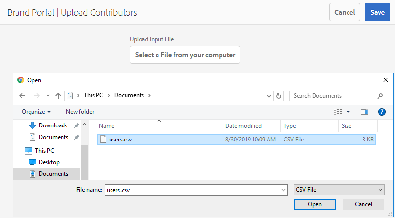

# Visão geral da Origem de ativos {#overview-asset-sourcing-in-bp}

A **Origem de ativos** permite que os usuários do Experience Manager Assets (administradores/usuários não administradores) criem novas pastas com uma propriedade adicional de **Contribuição de ativos**, garantindo que a nova pasta criada seja aberta para o envio de ativos pelos usuários do Brand Portal. Isso aciona automaticamente um fluxo de trabalho, o que cria duas subpastas adicionais, chamadas **COMPARTILHADAS** e **NOVAS**, na pasta **Contribuição** recém-criada. O administrador define o requisito carregando um resumo sobre os tipos de ativos que devem ser adicionados à pasta de contribuição. Eles carregam um conjunto de ativos da linha de base para a pasta **SHARED**, fornecendo aos usuários do Brand Portal as informações de referência necessárias. O administrador pode conceder aos usuários ativos do Brand Portal acesso à pasta de contribuição antes de publicar a pasta **Contribuição** recém-criada na Brand Portal. Quando o usuário terminar de adicionar conteúdo à pasta **NEW**, poderá publicar a pasta de contribuição de volta no ambiente de criação do Experience Manager. Observe que pode levar alguns minutos para concluir a importação e refletir o conteúdo recém-publicado no Experience Manager Assets.

Além disso, toda a funcionalidade existente permanece inalterada. Os usuários do Brand Portal podem exibir, pesquisar e baixar ativos da pasta contribuição e de outras pastas permitidas. Além disso, os administradores podem compartilhar a pasta de contribuição, modificar propriedades e adicionar ativos a coleções.

>[!VIDEO](https://video.tv.adobe.com/v/32894/?captions=por_br&quality=12)

## Pré-requisitos {#prerequisites}

* Instância do Experience Manager Assets as a Cloud Service, Experience Manager Assets 6.5.2 ou superior.
* Verifique se a instância do Experience Manager Assets está configurada com o Brand Portal. Consulte [Configurar Experience Manager Assets com Brand Portal](../using/configure-aem-assets-with-brand-portal.md).

<!--
* Ensure that your Brand Portal tenant is configured with one AEM Assets author instance.
-->

>[!NOTE]
>
>Por padrão, o recurso Origem de ativos está habilitado no Experience Manager Assets as a Cloud Service, Experience Manager Assets 6.5.9 e versões posteriores.
>
>As configurações existentes continuam a funcionar nas versões anteriores.

>[!NOTE]
>
>Há um problema conhecido no Experience Manager Assets 6.5.4. Os usuários do Brand Portal não podem publicar ativos da pasta de contribuição no Experience Manager Assets ao atualizar para o Adobe Developer Console.
>
>O problema foi corrigido no Experience Manager Assets 6.5.5. Você pode atualizar sua instância do Experience Manager Assets para o pacote de serviços mais recente e [atualizar as configurações](https://experienceleague.adobe.com/pt-br/docs/experience-manager-65/content/assets/brandportal/configure-aem-assets-with-brand-portal#upgrade-integration-65) no Adobe Developer Console.

<!--

>For immediate fix on AEM 6.5.4, it is recommended to [download the hotfix](https://www.adobeaemcloud.com/content/marketplace/marketplaceProxy.html?packagePath=/content/companies/public/adobe/packages/cq650/hotfix/cq-6.5.0-hotfix-33041) and install on your author instance.
-->

<!--
## Configure Asset Sourcing {#configure-asset-sourcing}

**Asset Sourcing** is configured from within the AEM Assets author instance. The administrators can enable the Asset Sourcing feature flag configuration from the **AEM Web Console Configuration** and upload the active Brand Portal users list in **AEM Assets**.

>[!NOTE]
>
>Asset Sourcing is by default enabled on AEM Assets as a Cloud Service. The AEM administrator can directly upload the active Brand Portal users to allow them access to the Asset Sourcing feature.

>[!NOTE]
>
>Before you begin with the configuration, ensure that your AEM Assets instance is configured with Brand Portal. See, [Configure AEM Assets with Brand Portal](../using/configure-aem-assets-with-brand-portal.md). 

The following video demonstrates, how to configure Asset Sourcing on your AEM Assets author instance:

>[!VIDEO](https://video.tv.adobe.com/v/29771)
-->

<!--
### Enable Asset Sourcing {#enable-asset-sourcing}

AEM administrators can enable the Asset Sourcing feature flag from within the AEM Web Console Configuration (a.k.a Configuration Manager).

>[!NOTE]
>
>This step is not applicable for AEM Assets as a Cloud Service.

**To enable Asset Sourcing:**
1. Log in to your AEM Assets author instance and open Configuration Manager. 
Default URL: http:// localhost:4502/system/console/configMgr.
1. Search using the keyword **Asset Sourcing** to locate **[!UICONTROL Asset Sourcing Feature Flag Config]**.
1. Click **[!UICONTROL Asset Sourcing Feature Flag Config]** to open the configuration window.
1. Select the **[!UICONTROL feature.flag.active.status]** check box.
1. Click **[!UICONTROL Save]**.

-->

### Fazer upload da lista de usuários do Brand Portal {#upload-bp-user-list}

Os administradores do Experience Manager Assets podem fazer upload do arquivo de configuração de usuário (.csv) do Brand Portal que contém a lista de usuários ativos do Brand Portal no Experience Manager Assets para permitir que eles acessem o recurso Origem de ativos.

Uma pasta de contribuição só pode ser compartilhada com os usuários ativos do Brand Portal definidos na lista de usuários. O administrador também pode adicionar novos usuários no arquivo de configuração e fazer upload da lista de usuários modificada.

>[!NOTE]
>
>Verifique se a instância do Experience Manager Assets está configurada com o Brand Portal. Consulte [Configurar Experience Manager Assets com Brand Portal](../using/configure-aem-assets-with-brand-portal.md).

>[!NOTE]
>
>O formato do arquivo CSV é igual ao formato compatível com o Admin Console para importação de usuários em massa. Email, nome e sobrenome são obrigatórios.

Os administradores podem adicionar novos usuários no Admin Console. Vá para [Gerenciar Usuários](brand-portal-adding-users.md) para obter informações detalhadas. Depois de adicionar usuários na Admin Console, eles podem ser adicionados ao arquivo de configuração de usuário do Brand Portal e receber permissão para acessar a pasta de contribuição.

**Para carregar a lista de usuários do Brand Portal:**

1. Faça logon na sua instância do Experience Manager Assets.
1. No painel [!UICONTROL Ferramentas], navegue até **[!UICONTROL Assets]** > **[!UICONTROL Usuários do Brand Portal]**.

1. A janela Brand Portal Upload Contributors é aberta.
Navegue pelo computador local e carregue um **arquivo de configuração (.csv)** contendo a lista de usuários ativos do Brand Portal.
1. Clique em **[!UICONTROL Salvar]**.

   

Os administradores podem fornecer acesso a usuários específicos nesta lista de usuários enquanto configuram uma pasta de contribuição. Somente os usuários atribuídos a uma pasta de contribuição têm acesso à pasta de contribuição e publicam ativos do Brand Portal na Experience Manager Assets.

## Consulte também: {#reference-articles}

* [Configurar e publicar uma pasta de contribuição para o Brand Portal](brand-portal-publish-contribution-folder-to-brand-portal.md)

* [Publicar pasta de contribuição no Experience Manager Assets](brand-portal-publish-contribution-folder-to-aem-assets.md)
