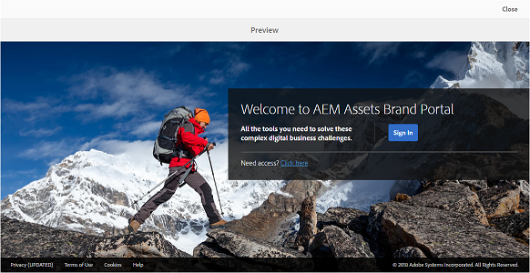
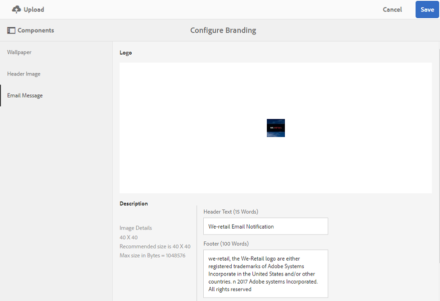

# Personalizar papel de parede, cabeçalho e mensagens de e-mail {#customize-wallpaper-header-and-email-message}

Os administradores do Brand Portal podem fazer personalizações limitadas na interface exibida aos usuários. Você pode escolher uma imagem de fundo (wallpaper) específica para a página de logon do Brand Portal. Você também pode adicionar uma imagem de cabeçalho e personalizar os emails de compartilhamento de ativos para corresponder à marca do cliente.

## Personalizar o papel de parede da tela de logon {#customize-the-login-screen-wallpaper}

Na ausência de uma imagem de papel de parede personalizada, um papel de parede padrão é exibido na página de logon.

1. Na barra de ferramentas na parte superior, clique no logotipo do Experience Manager para acessar as ferramentas administrativas.

   

1. No painel de ferramentas administrativas, clique em **[!UICONTROL Identidade Visual]**.

   

1. No painel esquerdo da página **[!UICONTROL Configurar Identidade Visual]**, o **[!UICONTROL Papel de Parede]** é selecionado por padrão. A imagem de fundo padrão que aparece na página de logon é exibida.

   

1. Para adicionar uma nova imagem de plano de fundo, clique no ícone **[!UICONTROL Escolher Imagem]** na barra de ferramentas, na parte superior.

   

   Siga uma das seguintes opções:

   * Para carregar uma imagem do seu computador, clique em **[!UICONTROL Carregar]**. Navegue até a imagem desejada e faça upload dela.
   * Para usar uma imagem existente do Brand Portal, clique em **[!UICONTROL Selecionar de existente]**. Escolha uma imagem usando o seletor de ativos.

   

1. Especifique um texto de cabeçalho e uma descrição para a imagem do plano de fundo. Para salvar as alterações, clique em **[!UICONTROL Salvar]** na barra de ferramentas, na parte superior.

1. Na barra de ferramentas, na parte superior, clique no ícone **[!UICONTROL Visualizar]** para gerar uma visualização da interface do Brand Portal com a imagem.

   

   

1. Para ativar ou desativar o papel de parede padrão, faça o seguinte na página **[!UICONTROL Configurar marca > Papel de parede]**:

   * Para exibir a imagem de papel de parede padrão na página de logon do Brand Portal, clique em **[!UICONTROL Desativar Papel de Parede]** na barra de ferramentas na parte superior. Uma mensagem confirma que a imagem personalizada está desativada.

   

   * Para restaurar a imagem personalizada na página de logon do Brand Portal, clique em **[!UICONTROL Ativar papel de parede]** na barra de ferramentas. Uma mensagem confirma que a imagem está restaurada.

   

   * Clique em **[!UICONTROL Salvar]** para salvar as alterações.

## Personalizar o cabeçalho {#customize-the-header}

O cabeçalho é exibido em várias páginas do Brand Portal depois de fazer logon no Brand Portal.

1. Na barra de ferramentas na parte superior, clique no logotipo do Experience Manager para acessar as ferramentas administrativas.

   

1. No painel de ferramentas administrativas, clique em **[!UICONTROL Identidade Visual]**.

   

1. Para personalizar o cabeçalho da página para a interface do Brand Portal, na página **[!UICONTROL Configurar Identidade Visual]**, selecione **[!UICONTROL Imagem do Cabeçalho]** no painel esquerdo. A imagem do cabeçalho padrão é exibida.

   

1. Para carregar uma imagem de cabeçalho, clique no ícone **[!UICONTROL Escolher Imagem]** e escolha **[!UICONTROL Carregar]**.

   Para usar uma imagem existente do Brand Portal, escolha **[!UICONTROL Selecionar a partir de uma existente]**.

   

   Escolha uma imagem usando o seletor de ativos.

   

1. Para incluir uma URL na imagem de cabeçalho, especifique-a na caixa **[!UICONTROL URL da Imagem]**. Você pode especificar URLs externos ou internos. Links internos também podem ser links relativos, por exemplo,
   [!UICONTROL `/mediaportal.html/content/dam/mac/tenant_id/tags`].
Esse link direciona os usuários para a pasta de tags.
Para salvar as alterações, clique em **[!UICONTROL Salvar]** na barra de ferramentas, na parte superior.

   

1. Na barra de ferramentas na parte superior, clique no ícone **[!UICONTROL Visualizar]** para gerar uma visualização da interface do Brand Portal com a imagem do cabeçalho.

   
   

1. Para ativar ou desativar a imagem de cabeçalho, faça o seguinte na página **[!UICONTROL Configurar identidade visual > Imagem de cabeçalho]**:

   * Para evitar que uma imagem de cabeçalho seja exibida em páginas do Brand Portal, clique em **[!UICONTROL Desativar Cabeçalho]** na barra de ferramentas, na parte superior. Uma mensagem confirma que a imagem está desativada.

   

   * Para fazer com que a imagem de cabeçalho reapareça nas páginas do Brand Portal, clique em **[!UICONTROL Ativar cabeçalho]** na barra de ferramentas, na parte superior. Uma mensagem confirma que a imagem está ativada.

   

   * Clique em **[!UICONTROL Salvar]** para salvar as alterações.

## Personalizar as mensagens de email {#customize-the-email-messaging}

Quando os ativos são compartilhados como um link, os usuários recebem um email contendo o link. Os administradores podem personalizar as mensagens, ou seja, o logotipo, a descrição e o rodapé desses emails.

1. Na barra de ferramentas na parte superior, clique no logotipo do Experience Manager para acessar as ferramentas administrativas.

   

1. No painel de ferramentas administrativas, clique em **[!UICONTROL Identidade Visual]**.

   

1. Quando os ativos são compartilhados como links ou baixados por email e quando **[!UICONTROL coleções]** são compartilhadas, as notificações por email são enviadas aos usuários. Para personalizar a mensagem de email, na página **[!UICONTROL Configurar Identidade Visual]**, selecione **[!UICONTROL Mensagem de Email]** no painel esquerdo.

   

1. Para adicionar um logotipo a emails de saída, clique em **[!UICONTROL Carregar]** na barra de ferramentas na parte superior.

1. Na seção **[!UICONTROL Descrição]**, especifique o texto do cabeçalho e do rodapé do email. Para salvar as alterações, clique em **[!UICONTROL Salvar]** na barra de ferramentas, na parte superior.

   >[!NOTE]
   >
   >Se você não usar o tamanho recomendado para o logotipo ou se o texto do cabeçalho e rodapé exceder a contagem de palavras recomendada, o conteúdo da mensagem de email poderá parecer ilegível.
