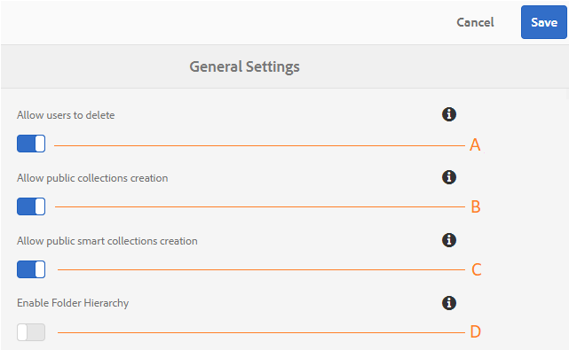

# Administrar configurações gerais de locatários {#administer-general-tenant-configurations}

O Experience Manager Assets Brand Portal permite que as organizações configurem os seguintes recursos para locatários específicos:

* Exclusão de ativos por administradores
* Criação de coleção pública por usuários não administradores
* Criação de coleção pública inteligente por usuários não administradores
* A hierarquia pai das pastas compartilhadas é visível para usuários não administradores

Essas configurações foram fornecidas como **[!UICONTROL Configurações gerais]** no painel de ferramentas administrativas.

**A** - Configuração que permite aos administradores excluir ativos da Brand Portal. (O padrão está ativado)

**B** - Configuração para permitir que usuários não administradores criem coleções públicas. (O padrão está ativado)

**C** - Configuração para permitir que usuários não administradores criem coleções públicas inteligentes. (O padrão está ativado)

**D** - Configuração para exibir a hierarquia de pastas (da raiz) de pastas compartilhadas para usuários não administradores (Editores, Visualizadores, Usuários Convidados). (O padrão está desativado)

## Ativar ou desativar configurações gerais {#enable-disable-general-configurations}

Para ativar ou desativar cada uma dessas configurações:

1. Efetue login com privilégios de administrador.
1. Selecione o logotipo do Experience Manager para acessar as ferramentas administrativas na barra de ferramentas na parte superior.
1. No painel de ferramentas administrativas, selecione **[!UICONTROL Geral]** para abrir a página **[!UICONTROL Configurações Gerais]**.
1. Use o respectivo switch para ativar ou desativar qualquer uma das configurações gerais.
1. **[!UICONTROL Salve]** as alterações.
1. Faça logout para que as alterações entrem em vigor.

## Permitir que usuários administradores excluam ativos do Brand Portal {#allow-admin-users-to-delete-assets-from-brand-portal}

**[!UICONTROL Permitir que os usuários excluam]** a configuração permite que as organizações permitam (ou restrinjam) que usuários com privilégios de administrador excluam ativos e pastas da Brand Portal.

## Permitir criação de coleções públicas por não administradores {#allow-public-collections-creation-by-non-admins}

[[!UICONTROL Permitir criação de coleções públicas]](../using/brand-portal-share-collection.md#main-pars-text-1915052376) a configuração controla se não administradores podem criar coleções públicas no Brand Portal. A configuração é ativada por padrão. Ao desabilitar a configuração, as organizações podem evitar ter várias coleções públicas em seus portais para que o espaço do sistema possa ser salvo.

## Permitir criação de coleções públicas inteligentes por não administradores {#allow-public-smart-collections-creation-by-non-admins}

[[!UICONTROL Permitir criação de coleções inteligentes públicas]](../using/brand-portal-searching.md#main-pars-header-500620467) controla se os usuários não administradores podem salvar suas pesquisas como coleções inteligentes e torná-las públicas para esse locatário. A configuração é ativada por padrão. Ao desabilitar a configuração, as organizações podem evitar que um grande número de coleções públicas inteligentes sejam criadas por usuários não administradores no Brand Portal da organização.

<!-- 
## Allow download acceleration {#allow-download-acceleration}

[[!UICONTROL Allow download acceleration]](../using/accelerated-download.md) configuration lets the organizations to allow accelerated downloads of assets from Brand Portal and shared links, by integrating with IBM Aspera Connect that is an install-on-demand application. The application uses proprietary technology to remove TCP overheads.
-->

## Habilitar hierarquia de pastas {#enable-folder-hierarchy}

A configuração [[!UICONTROL Habilitar Hierarquia de Pasta]](../using/brand-portal-sharing-folders.md#non-admin-user-access-to-shared-folders) permite que os administradores controlem como os usuários não administradores (Editores, Visualizadores e Usuários Convidados) veem as pastas compartilhadas depois de fazer logon.
