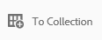

# Gerenciar a coleção lightbox {#manage-the-lightbox-collection}

**[!UICONTROL Lightbox]** é um tipo especial de coleção que fornece acesso fácil a ativos. Cada usuário tem uma **[!UICONTROL Lightbox]** exclusiva, criada automaticamente ao fazer logon no Brand Portal pela primeira vez. A coleção **[!UICONTROL Lightbox]** não pode ser excluída.

## Adicionar ativos ao lightbox {#add-assets-to-lightbox}

Para adicionar ativos à **[!UICONTROL Lightbox]**, faça o seguinte:

1. Navegue até o local dos ativos que deseja adicionar à **[!UICONTROL Lightbox]** e selecione os ativos.

   

1. Na barra de ferramentas na parte superior, clique no ícone **Adicionar à coleção**.

   

1. Na página **[!UICONTROL Adicionar à Coleção]**, a coleção **[!UICONTROL Lightbox]** é selecionada por padrão.

   Clique em **[!UICONTROL Adicionar]**. Os ativos selecionados foram adicionados à **[!UICONTROL Lightbox]**.

   

1. Para examinar os ativos adicionados a **[!UICONTROL Lightbox]**, clique em **[!UICONTROL Coleções]** no painel esquerdo e, em seguida, clique na coleção **[!UICONTROL Lightbox]**.

   

   Os ativos adicionados à **[!UICONTROL Lightbox]** aparecem na página **[!UICONTROL Lightbox]**.

   

## Remover ativos do lightbox {#remove-assets-from-lightbox}

1. Para examinar os ativos da [!UICONTROL Lightbox], clique em **[!UICONTROL Coleções]** no painel esquerdo e, em seguida, clique na coleção [!UICONTROL Lightbox].

   

1. Selecione a pasta que deseja remover da coleção e clique em **[!UICONTROL Remover]** na barra de ferramentas na parte superior.

   

1. Na caixa de mensagem de aviso, clique em **[!UICONTROL Remover]** para confirmar a remoção.

A pasta foi excluída da coleção **[!UICONTROL Lightbox]**.
