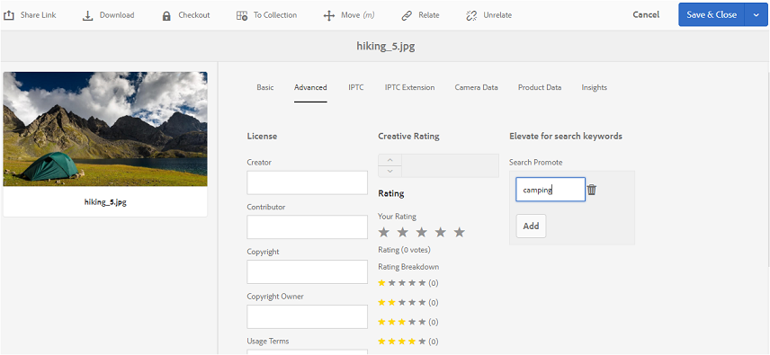

# Publicar tags no Brand Portal {#publish-tags-to-brand-portal}

Saiba como publicar tags do Experience Manager Assets na Brand Portal.

As tags são úteis na organização de ativos e melhoram a capacidade de pesquisa dos ativos aos quais estão associadas. As tags podem ser consideradas palavras-chave ou rótulos (metadados) anexados a ativos, que permitem que os ativos sejam rapidamente encontrados como resultado de uma pesquisa. Para saber como atribuir tags a ativos na Experience Manager Assets, consulte [usar tags para organizar ativos](https://experienceleague.adobe.com/pt-br/docs/experience-manager-65/content/assets/managing/organize-assets).

As tags (associadas a ativos e coleções na AEM) são publicadas automaticamente na Brand Portal quando os ativos (e coleções) com tags associadas são publicados na Brand Portal. As tags publicadas são úteis para permitir que as pesquisas localizem os ativos associados.

>[!NOTE]
>
>A Adobe recomenda publicar tags exclusivamente na Brand Portal antes de publicar os ativos (e coleções) aos quais as tags estão associadas. Essa abordagem garante a publicação mais rápida dos ativos (e coleções) no Brand Portal.

## Gerenciamento de tags {#manage-tags}

Você pode usar as marcas pré-existentes para anexar a um ativo ou criar novas marcas no console Marcas do AEM (**[!UICONTROL Ferramentas | Marcação com tags | Tags do AEM]**). Em ambos os cenários, primeiro publique as tags na Brand Portal e, em seguida, associe-as aos ativos apropriados.

Para criar tags no AEM, publicar as tags no Brand Portal e associá-las aos ativos (ou coleções) apropriados, siga estas etapas:

1. **Criar Marcas**
Faça logon em uma instância de Autor do AEM com privilégios administrativos e acesse o console **[!UICONTROL Tags do AEM]** na navegação global:

   1. Selecionar **[!UICONTROL Ferramentas]**

   1. Selecionar **[!UICONTROL Geral]**

   1. Selecionar **[!UICONTROL Marcação]**

1. Selecione **[!UICONTROL Criar]** e a opção **[!UICONTROL Criar tag]**.
1. Especifique:

   * **[!UICONTROL Título]**
     *(obrigatório)* Um título de exibição para a marca.
   * **[!UICONTROL Nome]**
     *(obrigatório)* Um nome para a marca. Se não for especificado, um nome de nó válido será criado a partir do Título. Consulte [TagID](https://experienceleague.adobe.com/pt-br/docs/experience-manager-65/content/implementing/developing/platform/tagging/framework).
   * **Descrição**
     *(opcional)* Uma descrição da marca.
   * **Caminho da marca**
Caminho JCR da tag.

1. Selecione **[!UICONTROL Enviar]** para criar a marca.

   Depois de criar uma tag em uma instância do AEM, a tag fica disponível para anexação a um ativo (usando a seção Propriedades ou a seção Gerenciar tags desse ativo).

1. **Publicar a marca no Brand Portal**.

   Vá para o console **[!UICONTROL Tags do AEM]** ([!UICONTROL Ferramentas | Marcação com tags | Tags do AEM &#x200B;]), selecione a tag desejada e Publicar na Brand Portal.

1. **Anexe a marca a um ativo (ou coleção)**.

   Selecione um ativo (ou coleção) e anexe a tag desejada usando a seção Propriedades ou a seção Gerenciar tags desse ativo. Para saber mais sobre como atribuir tags a ativos na AEM Assets, acesse [usar tags para organizar ativos](https://experienceleague.adobe.com/pt-br/docs/experience-manager-65/content/assets/managing/organize-assets).

1. **Publicar ativos (ou coleções) no Brand Portal**.\
   Ao publicar um ativo (ou coleção) no Brand Portal, a tag anexada também está disponível no Brand Portal.

   Para ver a tag anexada no respectivo ativo (ou coleção) no Brand Portal, faça logon no Brand Portal e selecione o ativo. Na seção Propriedades, é possível ver a tag anexada.

## Pesquisar Promover {#search-promote}

O AEM Assets Brand Portal permite fazer com que ativos específicos sejam os principais resultados de pesquisas baseadas em uma tag de palavra-chave.

Para elevar um ativo a uma palavra-chave de pesquisa, siga estas etapas:

1. Abra a página **[!UICONTROL Propriedades]** de um ativo na instância de autor do AEM.
1. Vá para a guia **[!UICONTROL Avançado]**.
1. Na **[!UICONTROL Promoção de Pesquisa]** da seção **[!UICONTROL Elevar para palavras-chave de pesquisa]**, selecione **[!UICONTROL Adicionar]** para adicionar palavras-chave ou marcas de pesquisa.

   

1. Salve as alterações.
1. Publique o ativo no Brand Portal.
1. Faça logon no Brand Portal. Exiba a guia **[!UICONTROL Avançado]** na seção **[!UICONTROL Propriedades]** do ativo.
Observe que a palavra-chave **[!UICONTROL Search Promote]** também está visível nas Propriedades desse ativo.
