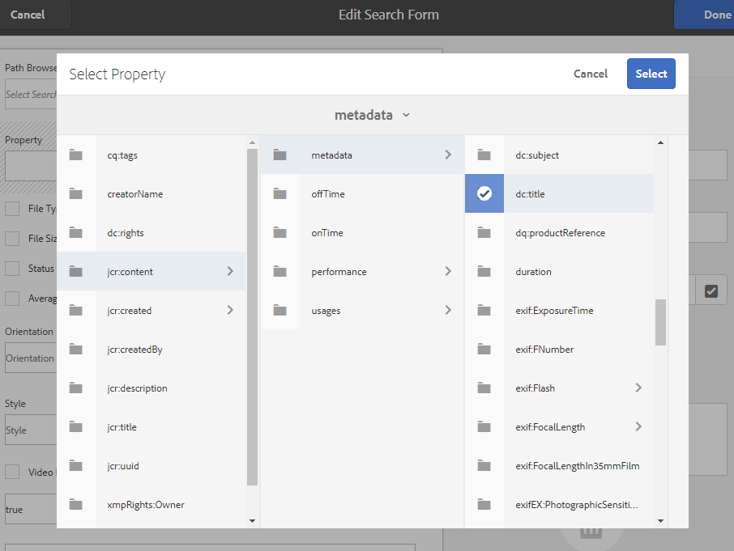

# Usar aspectos de pesquisa personalizados {#use-custom-search-facets}

Os administradores podem adicionar predicados de pesquisa ao painel [!UICONTROL Filtros] para personalizar a pesquisa e tornar a funcionalidade de pesquisa versátil.

A Brand Portal oferece suporte à [pesquisa facetada](../using/brand-portal-searching.md#search-using-facets-in-filters-panel) para pesquisas granulares de ativos de marca aprovados, o que é possível devido ao [**painel**](../using/brand-portal-searching.md#search-using-facets-in-filters-panel) dos Filtros. Os aspectos de pesquisa são disponibilizados no painel Filtros por meio do **[!UICONTROL Formulário de pesquisa]** nas ferramentas administrativas. Existe um formulário de pesquisa padrão chamado Painel de pesquisa do administrador de ativos na página Pesquisar no Forms nas ferramentas administrativas. No entanto, os administradores podem personalizar o painel Filtros padrão. Eles podem editar o formulário de pesquisa padrão (Painel de pesquisa do administrador de ativos) adicionando, editando ou removendo predicados de pesquisa, tornando a funcionalidade de pesquisa versátil.

Você pode usar vários predicados de pesquisa para personalizar o painel **[!UICONTROL Filtros]**. Por exemplo, adicione o predicado de propriedade para procurar ativos que correspondam a uma única propriedade especificada neste predicado. Adicione o predicado de opções para procurar ativos que correspondam a um ou mais valores especificados para uma propriedade específica. Adicione o predicado de intervalo de datas para pesquisar ativos criados em um intervalo de datas especificado.

>[!NOTE]
>
>O Experience Manager Assets permite que as organizações [publiquem os formulários de pesquisa personalizados do AEM Author](../using/publish-schema-search-facets-presets.md#publish-search-facets-to-brand-portal) na Brand Portal, em vez de recriar o mesmo formulário no Brand Portal.

## Adicionar um predicado de pesquisa ao painel Filtros {#add-a-search-predicate}

1. Para acessar as ferramentas administrativas, clique no logotipo Experience Manager na barra de ferramentas na parte superior.

   

1. No painel de ferramentas administrativas, clique em **[!UICONTROL Pesquisar Forms]**.

   

1. Na página **[!UICONTROL Pesquisar Forms]**, selecione **[!UICONTROL Painel de Pesquisa do Administrador do Assets]**.

   

1. Na barra de ferramentas exibida na parte superior, clique em **[!UICONTROL Editar]** para abrir o Formulário de Pesquisa e editá-lo.

   

1. Na página [!UICONTROL Editar formulário de pesquisa], arraste um predicado da guia [!UICONTROL Selecionar predicado] para o painel principal. Por exemplo, arraste o **[!UICONTROL Predicado de propriedade]**.

   O campo **[!UICONTROL Propriedade]** aparece no painel principal e a guia **[!UICONTROL Configurações]** à direita exibe os predicados da propriedade.

   

   >[!NOTE]
   >
   >O rótulo do cabeçalho na guia **[!UICONTROL Configurações]** identifica o tipo de predicado selecionado.

1. Na guia **[!UICONTROL Configurações]**, digite um rótulo, um texto para o espaço reservado e uma descrição para o predicado da propriedade.

   * Selecione **[!UICONTROL Pesquisa parcial]** se desejar permitir a pesquisa parcial de frases (e a pesquisa com curinga) de ativos com base no valor da propriedade especificada. Por padrão, o predicado é compatível com a pesquisa de texto completo.
   * Selecione **[!UICONTROL Ignorar maiúsculas e minúsculas]** se desejar que a pesquisa de ativos baseada no valor da propriedade não diferencie maiúsculas de minúsculas. Por padrão, a pesquisa por valores de propriedade no Filtro de pesquisa diferencia maiúsculas de minúsculas.

   >[!NOTE]
   >
   >Ao marcar a caixa de seleção **[!UICONTROL Pesquisa parcial]**, **[!UICONTROL Ignorar maiúsculas e minúsculas]** é selecionado por padrão.

1. No campo **[!UICONTROL Nome da Propriedade]**, abra o seletor de propriedades e selecione a propriedade com base na qual a pesquisa será realizada. Como alternativa, insira um nome para a propriedade. Por exemplo, insira `jcr :content/metadata/dc:title` ou `./jcr:content/metadata/dc:title`.

   >[!NOTE]
   >
   >No Brand Portal, todas as propriedades String (exceto aquelas que começam com `xmp`) em `jcrcontent/metadata` de `dam:asset` são indexadas por padrão. Por padrão, todas as outras propriedades personalizadas de qualquer tipo não são indexadas.
   >
   >Qualquer propriedade indexada pode ser usada ao criar um predicado de propriedade. Se qualquer propriedade não indexada for configurada, a consulta de pesquisa em uma propriedade não indexada poderá não fornecer nenhum resultado de pesquisa.

   

1. Clique em **[!UICONTROL Concluído]** para salvar as configurações.
1. Na interface de usuário do [!UICONTROL Assets], clique no ícone de sobreposição e escolha **[!UICONTROL Filtro]** para navegar até o painel **[!UICONTROL Filtros]**. O predicado **[!UICONTROL Property]** foi adicionado ao painel.

   

1. Digite um título para o ativo a ser pesquisado na caixa de texto **[!UICONTROL Propriedade]**. Por exemplo, &quot;Adobe&quot;. Ao realizar uma pesquisa, os ativos com o título correspondente a &quot;Adobe&quot; são exibidos nos resultados da pesquisa.

## Lista de predicados de pesquisa {#list-of-search-predicates}

Semelhante à maneira como você adiciona um predicado de **[!UICONTROL Propriedade]**, é possível adicionar os seguintes predicados ao painel **[!UICONTROL Filtros]**:

| **Nome do predicado** | **Descrição** | **Propriedades** |
|-------|-------|----------|
| **[!UICONTROL Navegador de caminhos]** | O predicado de pesquisa para pesquisar ativos em um local específico. **Observação:** *Para um usuário conectado, o Navegador de Caminho no Filtro mostra somente a estrutura de conteúdo das pastas (e seus antecessores) compartilhadas com o usuário.*   Usuários administradores podem pesquisar ativos em qualquer pasta navegando até essa pasta usando o Navegador de Caminhos.   Enquanto usuários não administradores podem pesquisar ativos em uma pasta (acessível a eles) navegando até essa pasta no Navegador de Caminhos. | <ul><li>Rótulo do campo</li><li>Caminho</li><li>Descrição</li></ul> |
| **[!UICONTROL Propriedade]** | Pesquise ativos com base em uma propriedade de metadados específica. **Observação:** *Ao selecionar Pesquisa Parcial, a opção Ignorar Maiúsculas e Minúsculas está selecionada por padrão*. | <ul><li>Rótulo do campo</li><li>Espaço reservado</li><li>Nome de propriedade</li><li>Pesquisa parcial</li><li>Ignorar diferença entre maiúsculas e minúsculas</li><li> Descrição</li></ul> |
| **[!UICONTROL Propriedade de Vários Valores]** | Semelhante a um predicado de propriedade, mas permite vários valores de entrada, separados por um delimitador (o padrão é uma vírgula), os ativos que correspondem a qualquer um dos valores de entrada são retornados em resultados. | <ul><li>Rótulo do campo</li><li>Espaço reservado</li><li>Nome da propriedade</li><li>Suporte do delimitador</li><li>Ignorar diferença entre maiúsculas e minúsculas</li><li>Descrição</li></ul> |
| **[!UICONTROL Tags]** | O predicado de pesquisa para pesquisar ativos com base em tags. Você pode configurar a propriedade Caminho para preencher várias tags na lista Tags. Talvez os administradores precisem alterar o valor do caminho, por exemplo, [!UICONTROL /`etc/tags/mac/<tenant_id>/<custom_tag_namespace>`]. Será necessário se eles publicarem o Formulário de pesquisa de AEM, onde o caminho não inclui informações do locatário, por exemplo, [!UICONTROL `/etc/tags/<custom_tag_namespace>`]. | <ul><li>Rótulo do campo</li><li>Nome da propriedade</li><li>Caminho</li><li>Descrição</li></ul> |
| **[!UICONTROL Caminho]** | O predicado de pesquisa para pesquisar ativos em um local específico. | <ul><li>Rótulo do campo</li><li>Caminho</li><li>Descrição</li></ul> |
| **[!UICONTROL Data relativa]** | O predicado de pesquisa para pesquisar ativos com base na data relativa de sua criação. | <ul><li>Rótulo do campo</li><li>Nome da propriedade</li><li>Data relativa</li></ul> |
| **[!UICONTROL Intervalo]** | O predicado de pesquisa para pesquisar ativos que estão dentro de um intervalo especificado de valores de propriedade. No painel Filtros, você pode especificar valores de propriedade mínimos e máximos para o intervalo. | <ul><li>Rótulo do campo</li><li>Nome da propriedade</li><li>Descrição</li></ul> |
| **[!UICONTROL Intervalo de datas]** | O predicado de pesquisa para pesquisar ativos criados em um intervalo especificado para uma propriedade de data. No painel Filtros, você pode especificar datas de início e término. | <ul><li>Rótulo do campo</li><li>Espaço reservado</li><li>Nome da propriedade</li><li>Intervalo de texto (de)</li><li>Intervalo de texto (até)</li><li>Descrição</li></ul> |
| **[!UICONTROL Data]** | Pesquisar predicado para uma pesquisa com base em controle deslizante de ativos com base em uma propriedade de data. | <ul><li>Rótulo do campo</li><li>Nome da propriedade</li><li>Descrição</li></ul> |
| **[!UICONTROL Tamanho do arquivo]** | O predicado de pesquisa para pesquisar ativos com base em seu tamanho. | <ul><li>Rótulo do campo</li><li>Nome da propriedade</li><li>Caminho</li><li>Descrição</li></ul> |
| **[!UICONTROL Última modificação do ativo]** | O predicado de pesquisa para pesquisar ativos com base na data da última modificação. | <ul><li>Rótulo do campo</li><li>Nome da propriedade</li><li>Descrição</li></ul> |
| **[!UICONTROL Status de aprovação]** | O predicado de pesquisa para pesquisar ativos com base na propriedade de metadados de aprovação. O nome de propriedade padrão é **`dam:status`**. | <ul><li>Rótulo do campo</li><li>Nome da propriedade</li><li>Descrição</li></ul> |
| **[!UICONTROL Verificar status]** | O predicado de pesquisa para pesquisar ativos com base no status de check-out de um ativo quando ele foi publicado na AEM Assets. | <ul><li>Rótulo do campo</li><li>Nome da propriedade</li><li>Descrição</li></ul> |
| **[!UICONTROL Retirado por]** | O predicado de pesquisa para pesquisar ativos com base no usuário que fez check-out do ativo. | <ul><li>Rótulo do campo</li><li>Nome da propriedade</li><li>Descrição</li></ul> |
| **[!UICONTROL Status de expiração]** | O predicado de pesquisa para pesquisar ativos com base no status de expiração. | <ul><li>Rótulo do campo</li><li>Nome da propriedade</li><li>Descrição</li></ul> |
| **[!UICONTROL Membro da coleção]** | O predicado de pesquisa para pesquisar ativos com base no fato de um ativo fazer parte de uma coleção. | Descrição |
| **[!UICONTROL Oculto]** | Esse predicado não é explicitamente visível para os usuários finais e é usado para qualquer restrição oculta normalmente para restringir o tipo de resultados de pesquisa a **`dam:Asset`**. | <ul><li>Rótulo do campo</li><li>Nome da propriedade</li><li>Descrição</li></ul> |

>[!NOTE]
>
>* Não use o **[!UICONTROL Predicado de opções]**, o **[!UICONTROL Predicado de status do Publish]** e o **[!UICONTROL Predicado de classificação]**, pois esses predicados não são funcionais no Brand Portal.
>* O predicado de tipo de pasta `(nt:folder type)` não tem suporte no Brand Portal e pode causar problemas de desempenho. Se estiver presente em um Formulário de pesquisa personalizado publicado, poderá ser excluído editando o Formulário de pesquisa.

## Excluir um predicado de pesquisa {#delete-a-search-predicate}

Para excluir um predicado de pesquisa, siga estas etapas:

1. Clique no logotipo Adobe para acessar as ferramentas administrativas.

   

1. No painel de ferramentas administrativas, clique em **[!UICONTROL Pesquisar Forms]**.

   

1. Na página **[!UICONTROL Pesquisar Forms]**, selecione **[!UICONTROL Painel de Pesquisa do Administrador do Assets]**.

   

1. Na barra de ferramentas exibida na parte superior, clique em **[!UICONTROL Editar]** para abrir o Formulário de Pesquisa e editá-lo.

   

1. Na página [!UICONTROL Editar Formulário de Pesquisa], no painel principal, selecione o predicado que deseja excluir. Por exemplo, selecione **[!UICONTROL Predicado da propriedade]**.

   A guia **[!UICONTROL Configurações]** à direita exibe campos de predicado de propriedade.

1. Para excluir o predicado de propriedade, clique no ícone de compartimento. Na caixa de diálogo **[!UICONTROL Excluir Campo]**, clique em **[!UICONTROL Excluir]** para confirmar a ação de exclusão.

   O campo **[!UICONTROL Predicado da Propriedade]** é removido do painel principal, e a guia **[!UICONTROL Configurações]** fica vazia.

   

1. Para salvar as alterações, clique em **[!UICONTROL Concluído]** na barra de ferramentas.
1. Na interface de usuário do **[!UICONTROL Assets]**, clique no ícone de sobreposição e escolha **[!UICONTROL Filtro]** para navegar até o painel **[!UICONTROL Filtros]**. O predicado **[!UICONTROL Property]** foi removido do painel.

   
