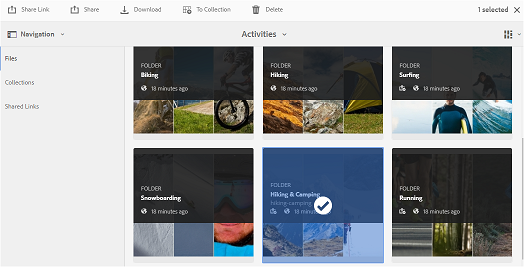

# Compartilhar pastas no Brand Portal {#share-folders}

O Assets precisa ser publicado no Brand Portal a partir de uma instância pré-configurada do autor do Experience Manager, pois o Brand Portal não é compatível com a assimilação de ativos.

## Fluxo de trabalho de compartilhamento de pastas no Brand Portal {#folder-sharing-workflow-in-brand-portal}

A seguir, é descrito o fluxo de trabalho de compartilhamento de pastas e o acesso do usuário:

* Por padrão, todas as pastas publicadas do Experience Manager Assets para o Brand Portal ficam visíveis somente para o administrador do Brand Portal, a menos que marcadas como públicas durante a configuração da replicação.
* O Administrador usa o console **[!UICONTROL Propriedades da Pasta]** para compartilhar uma pasta com usuários ou grupos seletivos. Somente os usuários ou grupos com os quais a pasta é compartilhada podem ver a pasta depois de fazerem logon no Brand Portal. A pasta não está visível para outros usuários.
* O administrador também pode optar por tornar uma pasta pública através da caixa de seleção **[!UICONTROL Pasta Pública]** no console **[!UICONTROL Propriedades da Pasta]**. Uma pasta pública fica visível para todos os usuários.

* Independentemente das funções e privilégios do usuário, quando os usuários fazem logon no Brand Portal, eles visualizam todas as pastas públicas e as pastas compartilhadas diretamente com eles ou com um grupo ao qual pertencem. As pastas privadas ou compartilhadas com outros usuários não estão visíveis para todos os usuários.

### Compartilhar pastas com grupos de usuários no Brand Portal {#sharing-folders-with-user-groups-on-brand-portal}

Os direitos de acesso aos ativos de uma pasta dependem dos direitos de acesso em sua pasta principal, independentemente das configurações das pastas secundárias. [As ACLs](https://experienceleague.adobe.com/pt-br/docs/experience-manager-65/content/security/security) no AEM controlam esse comportamento, com pastas filho herdando ACLs de suas pastas pai. Por exemplo, suponha que a pasta A contenha a pasta B, que contém a pasta C. Em seguida, um grupo de usuários (ou usuários) com direitos de acesso na pasta A também têm os mesmos direitos de acesso na pasta B e na pasta C. A pasta B, que é a pasta filho de A, herda suas ACLs, e a pasta C, que é a pasta filho de B, herda suas ACLs.

Da mesma forma, os grupos de usuários (ou usuários) que têm permissões para acessar somente a pasta B têm as mesmas permissões de acesso na pasta C, mas não na pasta A. O Adobe recomenda organizar o conteúdo para que os ativos mais expostos sejam colocados em pastas secundárias, permitindo que o acesso seja restrito das pastas secundárias até a pasta raiz.

### Publicação de pasta pública {#public-folder-publish}

Usuários não administradores (como Editores e Visualizadores) podem acessar ativos publicados do AEM Assets para o Brand Portal somente se a opção **[!UICONTROL Pasta pública do Publish]** estiver selecionada durante a configuração de replicação do Brand Portal.

Se a opção **[!UICONTROL Publish de Pasta Pública]** estiver desabilitada, os administradores precisarão compartilhar esses ativos especificamente com usuários não administradores que usam o recurso de compartilhamento.

>[!NOTE]
>
>A opção para habilitar o **[!UICONTROL Publish de Pasta Pública]** está disponível a partir do AEM 6.3.2.1.

## Acesso a pastas compartilhadas {#access-to-shared-folders}

A matriz a seguir discute os direitos de acesso e os direitos para compartilhar ou cancelar o compartilhamento de ativos para várias funções de usuário:

|               | Acesso a todas as pastas publicadas do AEM Assets para o Brand Portal | Acesso a pastas compartilhadas | Compartilhar ou cancelar o compartilhamento de direitos da pasta |
|---------------|-----------|-----------|------------|
| Administrador | Sim | Sim | Sim |
| Editor | Não* | Sim, somente se compartilhado com eles ou com o grupo ao qual pertencem | Sim, somente para as pastas compartilhadas com eles ou com o grupo ao qual pertencem |
| Visualizador | Não* | Sim, somente se compartilhado com eles ou com o grupo ao qual pertencem | Não |
| Usuário convidado | Não* | Sim, somente se compartilhado com eles ou com o grupo ao qual pertencem | Não |

>[!NOTE]
>
>Por padrão, a opção **[!UICONTROL Publish de Pasta Pública]** é desabilitada ao configurar a replicação do Brand Portal com o AEM Author. Se a opção estiver ativada, as pastas publicadas no Brand Portal serão acessíveis a todos os usuários (usuários não administradores também) por padrão.

### Acesso de usuário não administrador a pastas compartilhadas {#non-admin-user-access-to-shared-folders}

Usuários não administradores podem acessar somente as pastas compartilhadas com eles no Brand Portal. No entanto, a forma como essas pastas são exibidas no portal quando fazem logon depende das configurações da **[!UICONTROL Habilitar Hierarquia de Pastas]**.

**Se a configuração estiver desabilitada**

Usuários não administradores podem ver todas as pastas compartilhadas com eles na página de aterrissagem ao fazer logon na Brand Portal.

**Se a configuração estiver habilitada**

Os usuários não administradores veem a árvore de pastas (começando pela pasta raiz) e as pastas compartilhadas organizadas nas respectivas pastas principais, ao fazer logon na Brand Portal.

Essas pastas principais são pastas virtuais e nenhuma ação pode ser executada nelas. Você pode reconhecer essas pastas virtuais com um ícone de cadeado.

Nenhuma tarefa de ação está visível ao passar o cursor sobre elas ou selecioná-las na **[!UICONTROL Exibição de Cartão]**, ao contrário das pastas compartilhadas. O botão **[!UICONTROL Visão Geral]** é mostrado ao selecionar uma pasta virtual na **[!UICONTROL Exibição de Coluna]** e na **[!UICONTROL Exibição de Lista]**.

>[!NOTE]
>
>Observe que a miniatura padrão das pastas virtuais é a imagem em miniatura da primeira pasta compartilhada.

   

## Compartilhar pastas {#how-to-share-folders}

Para compartilhar uma pasta com usuários no Brand Portal, siga estas etapas:

1. Clique no ícone de sobreposição à esquerda e escolha **[!UICONTROL Navegação]**.

   

1. No painel lateral à esquerda, selecione **[!UICONTROL Arquivos]**.

   

1. Na interface do Brand Portal, selecione a pasta que deseja compartilhar.

   

1. Na barra de ferramentas na parte superior, selecione **[!UICONTROL Compartilhar]**.

   

   O console [!UICONTROL Propriedades da Pasta] é exibido.

   

1. No console **[!UICONTROL Propriedades da Pasta]**, especifique o título da pasta no campo **[!UICONTROL Título da Pasta]** se não quiser que o nome padrão seja exibido aos usuários.
1. Na lista **[!UICONTROL Adicionar Usuário]**, selecione os usuários ou grupos com os quais deseja compartilhar a pasta e clique em **[!UICONTROL Adicionar]**.
Para compartilhar a pasta somente com usuários convidados e nenhum outro usuário, selecione **[!UICONTROL Usuários Anônimos]** na lista suspensa **[!UICONTROL Membros]**.

   

   >[!NOTE]
   >
   >Para disponibilizar a pasta para todos os usuários independentemente de sua associação de grupo e função, torne-a pública marcando a caixa de seleção **[!UICONTROL Pasta Pública]**.

1. Se necessário, clique em **[!UICONTROL Alterar miniatura]** para modificar a imagem em miniatura da pasta.
1. Clique em **[!UICONTROL Salvar]**.

1. Para acessar a pasta compartilhada, faça logon no Brand Portal com as credenciais do usuário com o qual você compartilhou a pasta. Revise a pasta compartilhada na interface.

## Cancelar compartilhamento de pastas {#unshare-the-folders}

Para cancelar o compartilhamento de uma pasta compartilhada anteriormente, siga estas etapas:

1. Na interface do Brand Portal, selecione a pasta que deseja cancelar o compartilhamento.

   

1. Na barra de ferramentas na parte superior, clique em **[!UICONTROL Compartilhar]**.
1. No console **[!UICONTROL Propriedades da Pasta]**, em **[!UICONTROL Membros]**, clique no símbolo **[!UICONTROL x]** ao lado de um usuário para removê-lo da lista de usuários com os quais você compartilhou a pasta.

   

1. Na caixa de mensagem de aviso, clique em **[!UICONTROL Confirmar]** para confirmar o cancelamento do compartilhamento.
Clique em **[!UICONTROL Salvar]**.

1. Faça logon no Brand Portal com as credenciais do usuário que você removeu da lista compartilhada. A pasta não está mais disponível na interface do Brand Portal para o usuário.
