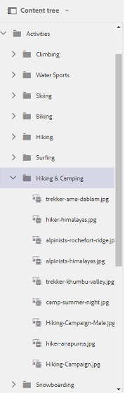

# Procurar ativos no Brand Portal {#browsing-assets-on-brand-portal}

O Experience Manager Assets Brand Portal oferece vários recursos e elementos de interface do usuário que facilitam a navegação por recursos, a navegação em hierarquias de ativos e a pesquisa de ativos usando diferentes opções de exibição.

O logotipo Experience Manager na barra de ferramentas na parte superior facilita que os usuários administradores acessem o painel de ferramentas administrativas.

O seletor de painéis na parte superior esquerda do menu suspenso Brand Portal expõe as opções para navegar até as hierarquias de ativos, simplificar sua pesquisa e exibir recursos.

Você pode visualizar, navegar e selecionar ativos usando qualquer uma das exibições disponíveis (Cartão, Coluna e Lista) no seletor de exibições do Brand Portal.

## Visualização e seleção de recursos {#viewing-and-selecting-resources}

Visualizar, navegar e selecionar cada um é conceitualmente igual em todas as exibições, mas tem pequenas variações de manuseio, dependendo da exibição usada.

Você pode visualizar, navegar e selecionar (para novas ações) seus recursos com qualquer uma das exibições disponíveis:

* Exibição de coluna
* Exibição de cartão
* Exibição de lista

### Exibição de cartão

A exibição de cartão mostra cartões de informação para cada item no nível atual. Esses cartões fornecem os seguintes detalhes:

* Uma representação visual do ativo/pasta.
* Tipo
* Título
* Nome
* Data e hora em que o ativo foi publicado no Brand Portal a partir do AEM
* Tamanho
* Dimensões

Você pode navegar para baixo na hierarquia clicando em cartões (com cautela para evitar as ações rápidas) ou para cima novamente usando a [navegação estrutural no cabeçalho](https://experienceleague.adobe.com/pt-br/docs/experience-manager-65/content/sites/authoring/essentials/basic-handling).

#### Exibição de cartão para usuários não administradores

Cartões de pastas, na Exibição de cartão, exibem informações de hierarquia de pastas para usuários não administradores (Editor, Visualizador e Usuário convidado). Essa funcionalidade permite que os usuários saibam a localização das pastas que estão acessando, com relação à hierarquia principal.

As informações de hierarquia de pastas são particularmente úteis na diferenciação das pastas que têm nomes semelhantes a outras pastas compartilhadas de uma hierarquia de pastas diferente. Se os usuários não administradores não estiverem cientes da estrutura de pastas dos ativos compartilhados com eles, ativos/pastas com nomes semelhantes parecem confusos.

* Os caminhos mostrados nas respectivas placas estão truncados para se ajustarem aos tamanhos da placa. No entanto, os usuários podem ver o caminho completo como uma dica de ferramenta, passando o cursor do mouse sobre o caminho truncado.

**Opção de visão geral para exibir as propriedades do ativo**

A opção Visão geral está disponível para usuários não administradores (Editores, Visualizadores, Usuários convidados) para exibir propriedades de ativos de ativos/pastas selecionados. A opção Visão geral está visível:

* Na barra de ferramentas, na parte superior, em selecione um ativo/pasta.
* Na lista suspensa, em selecione o seletor de painéis.

Ao selecionar a opção **[!UICONTROL Visão geral]** enquanto um ativo/pasta é selecionado, os usuários podem ver o título, o caminho e a hora da criação do ativo. Enquanto na página de detalhes do ativo, selecionar a opção Visão geral permite que os usuários vejam os metadados do ativo.

#### Exibir configurações na exibição de cartão

A caixa de diálogo **[!UICONTROL Configurações de Exibição]** é aberta ao selecionar **[!UICONTROL Configurações de Exibição]** no seletor de exibições. Ela permite redimensionar as miniaturas de ativos na Exibição de cartão. Dessa forma, você pode personalizar a visualização e controlar o número de miniaturas exibidas.

### Exibição de lista

A exibição de lista exibe informações para cada recurso no nível atual. A exibição em Lista fornece os seguintes detalhes:

* Imagem em miniatura de ativos
* Nome
* Título
* Localidade
* Tipo
* Dimensão
* Tamanho
* Avaliação
* Caminho da pasta mostrando a hierarquia de ativos
* Data de publicação do ativo no Brand Portal

A coluna de caminho permite identificar facilmente o local do ativo na hierarquia de pastas. Você pode navegar para baixo na hierarquia clicando no nome do recurso e fazer backup usando a [navegação estrutural no cabeçalho](https://experienceleague.adobe.com/pt-br/docs/experience-manager-65/content/sites/authoring/essentials/basic-handling).

<!--
Comment Type: draft lastmodifiedby="mgulati" lastmodifieddate="2018-08-17T03:12:05.096-0400" type="annotation">Removed:- "Selecting assets in list view To select all items in the list, use the checkbox at the upper left of the list. When all items in the list are selected, this check box appears checked. To deselect all, click the checkbox. When only some items are selected, it appears with a minus sign. To select all, click the checkbox. To deselect all, click the checkbox again. You can change the order of items using the dotted vertical bar at the far right of each item in the list. Click the vertical selection bar and drag the item to a new position in the list."
 -->

### Exibir configurações na exibição de lista

A exibição em Lista mostra o ativo **[!UICONTROL Nome]** como a primeira coluna por padrão. Informações adicionais, como ativo **[!UICONTROL Título]**, **[!UICONTROL Local]**, **[!UICONTROL Tipo]**, **[!UICONTROL Dimension]**, **[!UICONTROL Tamanho]**, **[!UICONTROL Classificação]**, status de publicação também são mostradas. No entanto, você pode selecionar as colunas a serem mostradas usando **[!UICONTROL Configurações de Exibição]**.

### Exibição de coluna

Use a exibição de coluna para navegar em uma árvore de conteúdo por uma série de colunas em cascata. Essa exibição ajuda a visualizar e atravessar a hierarquia de ativos.

Selecionar um recurso na primeira coluna (mais à esquerda) exibe os recursos-filho na segunda coluna à direita. Selecionar um recurso na segunda coluna exibe os recursos secundários na terceira coluna à direita e assim por diante.

Você pode navegar para cima e para baixo na árvore. Clique no nome do recurso ou na divisa à direita do nome do recurso.

* O nome do recurso e a divisa são realçados quando clicados.
* Tocar ou clicar na miniatura seleciona o recurso.
* Quando selecionada, uma marca de seleção é sobreposta à miniatura e o nome do recurso é realçado.
* Os detalhes do recurso selecionado serão mostrados na coluna final.

Quando um ativo é selecionado na exibição de coluna, uma representação visual do ativo é exibida na coluna final junto com os seguintes detalhes:

* Título
* Nome
* Dimensões
* Data e hora em que o ativo foi publicado no Brand Portal a partir do AEM
* Tamanho
* Tipo
* Opção Mais detalhes que acompanha a página de detalhes do ativo

<!--
Comment Type: draft

<h3>Selecting Resources</h3>
-->

<!--
Comment Type: draft

Selecting a specific resource depends on a combination of the view and the device:

-->

<!--
Comment Type: draft

<table border="1" cellpadding="1" cellspacing="0" width="100%">
<tbody>
<tr>
<td> </td>
<td>Select</td>
<td>Deselect</td>
</tr>
<tr>
<td>Column View  </td>
<td>
<ul>
<li>Desktop:  Mouseover, then use the check mark quick action</li>
<li>Mobile device:  Tap the thumbnail</li>
</ul> </td>
<td>
<ul>
<li>Desktop:  Click the thumbnail</li>
<li>Mobile device:  Tap the thumbnail</li>
</ul> </td>
</tr>
<tr>
<td>Card View  </td>
<td>
<ul>
<li>Desktop:  Mouseover, then use the check mark quick action</li>
<li>Mobile device:  Tap-and-hold the card</li>
</ul> </td>
<td>
<ul>
<li>Desktop:  Click the card</li>
<li>Mobile device:  Tap the card</li>
</ul> </td>
</tr>
<tr>
<td>List View</td>
<td>
<ul>
<li>Desktop:  Mouseover, then use the check mark quick action</li>
<li>Mobile device:  Tap the thumbnail</li>
</ul> </td>
<td>
<ul>
<li>Desktop:  Click the thumbnail</li>
<li>Mobile device:  Tap the thumbnail</li>
</ul> </td>
</tr>
</tbody>
</table>
-->

<!--
Comment Type: draft

Deselecting All
-->

<!--
Comment Type: draft

In all cases, as you select items the count of the items selected is displayed at the upper right of the toolbar.

You can deselect all items and exit selection mode by clicking the X next to the count.

-->

<!--
Comment Type: draft

In all views, all items can be deselected by clicking escape on the keyboard if you are using a desktop device.

-->

## Árvore de conteúdo {#content-tree}

Além dessas exibições, use a exibição em árvore para detalhar a hierarquia de ativos enquanto exibe e seleciona os ativos ou pastas desejados.

Para abrir a exibição em árvore, clique no seletor de painéis na parte superior esquerda e selecione a **[!UICONTROL Árvore de conteúdo]** no menu.

Na hierarquia de conteúdo, navegue até o ativo desejado.

## Detalhes do ativo {#asset-details}

A página Detalhes do ativo permite visualizar um ativo, baixá-lo, compartilhar o link do ativo, movê-lo para uma coleção ou exibir sua página de propriedades. Também permite navegar pela página de detalhes de outros ativos da mesma pasta sucessivamente.

Para exibir os metadados do ativo ou exibir suas várias representações, use o seletor do painel na página Detalhes do ativo.

Você pode exibir todas as representações disponíveis do ativo na página de detalhes do ativo e selecionar uma representação no painel **[!UICONTROL Representações]** para visualizá-la.

<!-- removed as it is fixed in 2022.02.0 release
>[!CAUTION]
>
>(**Experience Manager Assets as a Cloud Service** only) The following known issues will be fixed in the upcoming release:
>
>The **[!UICONTROL Renditions]** panel does not list all the static renditions of the assets that are published to Brand Portal after December 16, 2021.
>
>The **[!UICONTROL Renditions]** panel lists the smart crop renditions of the asset, however, the user cannot preview or download the smart crop renditions.
-->

Para abrir a página de propriedades do ativo, use a opção **[!UICONTROL Propriedades (p)]** na barra superior.

Você também pode exibir uma lista de todos os seus ativos relacionados (ativos de origem ou derivados no AEM) na página de propriedades de um ativo, já que o relacionamento entre ativos também é publicado do AEM para o Brand Portal.
