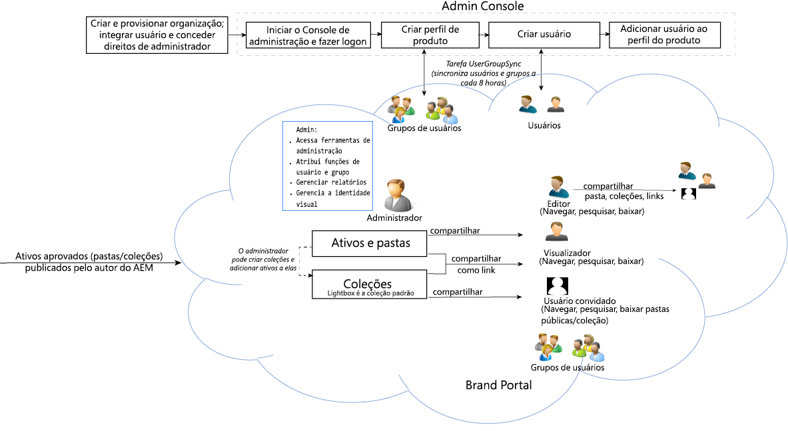

# Guia do Adobe Experience Manager Assets Brand Portal {#aem-brand-portal}

O **Adobe Experience Manager Assets Brand Portal** ajuda as organizações a atender às suas necessidades de marketing distribuindo com segurança ativos de marca e produto aprovados para agências externas, parceiros, equipes internas e revendedores para download.

A falta de uma solução de compartilhamento de ativos seguros pode resultar em:

* Compartilhamento manual de ativos por e-mail ou nuvem
* Problemas de conformidade da marca
* Falta de controle sobre o uso dos ativos
* Atraso nas campanhas e lançamentos de produtos
* Duplicação de conteúdo em localizações e organizações geográficas
* Armazenamento inseguro de ativos antes do lançamento

O Brand Portal garante a conformidade da marca permitindo que os profissionais de marketing colaborem com parceiros e usuários internos para criar, gerenciar e entregar diretrizes de design, logotipos e ativos de campanha às partes interessadas.

Brand Portal é uma oferta SAAS baseada em nuvem. Ele está disponível como um complemento do produto Adobe Experience Manager Assets (no local ou serviço gerenciado). Você pode utilizar o Brand Portal com o [!DNL Adobe Experience Manager Assets] as a [!DNL Cloud Service]. Depois de [configurado](https://experienceleague.adobe.com/pt-br/docs/experience-manager-cloud-service/content/assets/brand-portal/configure-aem-assets-with-brand-portal), você pode publicar ativos aprovados de uma instância do [!DNL Adobe Experience Manager Assets] as a [!DNL Cloud Service] para o [!DNL Brand Portal] e distribuí-los aos usuários do Brand Portal.

O fluxo de trabalho da solução Brand Portal está ilustrado na imagem a seguir.

## Guia do usuário Adobe Experience Manager Brand Portal

Este guia do usuário documenta insights para ofertas e fluxos de trabalho principais do Brand Portal. Use o painel à esquerda para navegar pelas várias funcionalidades e vá para baixo para conhecer como pessoas diferentes interagem com o portal.

### Consulte também:

| Guia do usuário | Descrição |
|--- |---|
| [Novidades](whats-new.md) | Alterações feitas no Brand Portal. |
| [Notas de lançamento](brand-portal-release-notes.md) | Aprimoramentos, problemas críticos corrigidos e problemas conhecidos na versão atual. |
| [Configurar o Experience Manager Assets com o Brand Portal](../using/configure-aem-assets-with-brand-portal.md) | Como replicar o Brand Portal com o Experience Manager Assets para publicar ativos. |
| [Solucionar problemas na publicação paralela](troubleshoot-parallel-publishing.md) | Solucione problemas de replicação entre o Brand Portal e o Experience Manager Assets. |
| [Formatos de arquivo não suportados](brand-portal-supported-formats.md) | Formatos de arquivo suportados no Brand Portal para visualização e download. |
| [Publicar ativos no Brand Portal](brand-portal-sharing-folders.md) | Como publicar pastas, coleções, links, predefinições, esquema, aspectos e tags no Brand Portal. |
| [Origem de ativos no Brand Portal](brand-portal-asset-sourcing.md) | Como configurar a Origem de ativos no AEM Assets, fazer upload de ativos no Brand Portal e publicar a pasta de contribuição de volta no AEM Assets. |
| [Vídeos de recursos do Brand Portal](https://experienceleague.adobe.com/?lang=pt-br&amp;tag=Brand+Portal#recommended/solutions/experience-manager) | Saiba como usar o Experience Manager Assets Brand Portal com a ajuda de tutoriais em vídeo. |

### Recursos úteis

* [Compreensão do Brand Portal com o AEM Assets](https://experienceleague.adobe.com/pt-br/docs/experience-manager-brand-portal/using/home)
