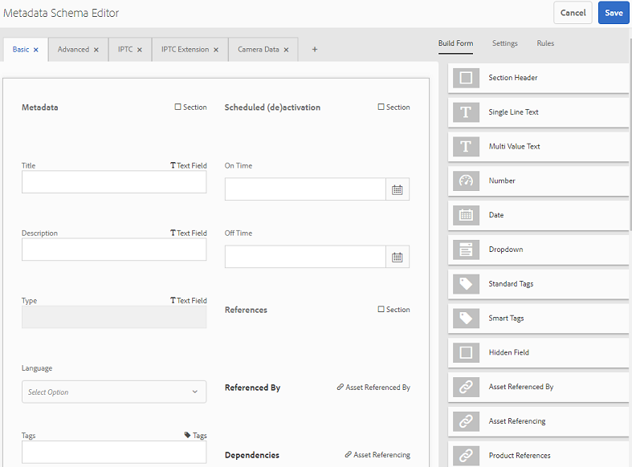
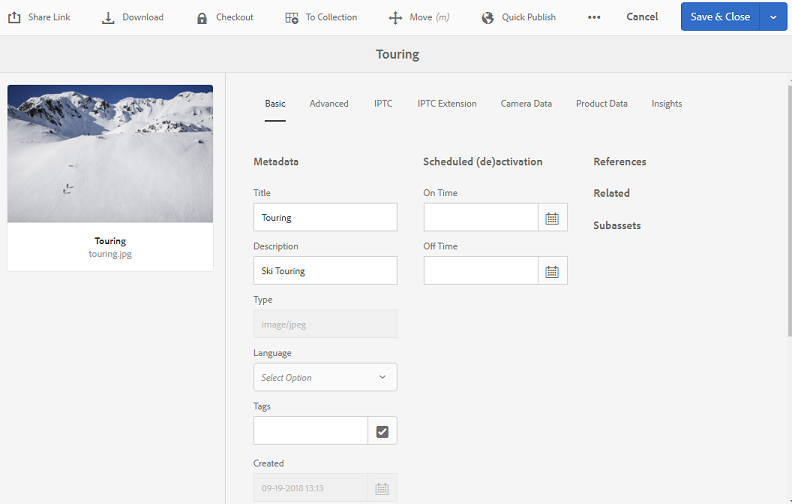
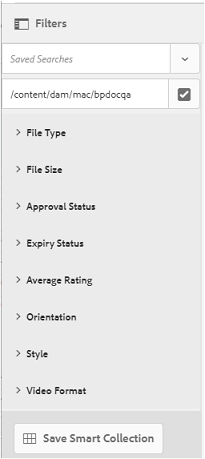

# Publicar predefinições, esquema e aspectos no Brand Portal {#publish-presets-schema-and-facets-to-brand-portal}

O artigo aborda a publicação de predefinições de imagem, esquemas de metadados e aspectos de pesquisa personalizados da instância do autor do AEM para o Brand Portal. O recurso de publicação permite que as organizações reutilizem as predefinições de imagens, os esquemas de metadados e os aspectos de pesquisa criados ou editados em uma instância do AEM Author. Essa abordagem reduz os esforços duplicados.

>[!NOTE]
>
>A capacidade de publicar predefinições de imagem, esquema de metadados e aspectos de pesquisa da instância do AEM Author para o Brand Portal está disponível a partir do AEM 6.2 SP1-CFP7 e do AEM 6.3 SP 1-CFP 1 (6.3.1.1).

## Publicar predefinições de imagem no Brand Portal {#publish-image-presets-to-brand-portal}

As predefinições de imagem são um conjunto de comandos de dimensionamento e formatação aplicados à imagem no momento da entrega da imagem. As predefinições de imagem podem ser criadas e modificadas no Brand Portal. Como alternativa, se uma instância do AEM Author estiver sendo executada no modo Dynamic Media, os usuários poderão criar predefinições no AEM Author e publicá-las no AEM Assets Brand Portal. Essa abordagem evita recriar as mesmas predefinições no Brand Portal.
Após a criação da predefinição, ela é listada como uma representação dinâmica no painel de representações de detalhes do ativo e na caixa de diálogo de download.

>[!NOTE]
>
>Se a instância do Autor do AEM não estiver em execução no **[!UICONTROL Modo Dynamic Media]** (o cliente não adquiriu o Dynamic Media), a representação **[!UICONTROL Pyramid TIFF]** dos ativos não será criada no momento do carregamento. As predefinições de imagem ou representações dinâmicas funcionam na **[!UICONTROL Pyramid TIFF]** de um ativo. Portanto, se a **[!UICONTROL Pyramid TIFF]** não estiver disponível na instância do Autor do AEM, ela não estará disponível no Brand Portal. Como resultado, nenhuma representação dinâmica está presente no painel de representações da página Detalhes do ativo e na caixa de diálogo de download.

Para publicar predefinições de imagem no Brand Portal:

1. Na instância do AEM Author, clique no logotipo do AEM para acessar o console de navegação global, clique no ícone Ferramentas e navegue até **[!UICONTROL Assets > Predefinições de imagem]**.
1. Selecione a predefinição de imagem ou várias predefinições de imagem na lista de predefinições de imagens e clique em **[!UICONTROL Publicar no Brand Portal]**.

>[!NOTE]
>
>Quando os usuários clicam em **[!UICONTROL Publicar no Brand Portal]**, as predefinições de imagem são enfileiradas para publicação. Os usuários são aconselhados a monitorar o log dos agentes de replicação para confirmar se a publicação foi bem-sucedida.

Para desfazer a publicação de uma predefinição de imagem do Brand Portal:

1. Na instância do AEM Author, clique no logotipo do AEM para acessar o console de navegação global, clique no ícone **[!UICONTROL Ferramentas]** e navegue até **[!UICONTROL Assets > Predefinições de Imagem]**.
1. Selecione uma predefinição de imagem e selecione **[!UICONTROL Remover do Brand Portal]** entre as opções disponíveis na parte superior.

## Publicar esquema de metadados no Brand Portal {#publish-metadata-schema-to-brand-portal}

O esquema de metadados descreve o layout e as propriedades exibidas na página de propriedades do ativo/coleções.

 

Se os usuários editarem o esquema padrão em uma instância do AEM Author e quiserem usar o mesmo esquema que o esquema padrão na Brand Portal, publique os formulários de esquema de metadados na Brand Portal. Nesse cenário, os esquemas padrão publicados na instância do AEM Author substituem o esquema padrão na Brand Portal.

Se os usuários tiverem criado um esquema personalizado na instância do Autor do AEM, eles poderão publicar o esquema personalizado na Brand Portal em vez de recriar o mesmo esquema personalizado lá. Os usuários podem aplicar esse esquema personalizado a qualquer pasta/coleção no Brand Portal.

>[!NOTE]
>
>Esquemas padrão não podem ser publicados na Brand Portal se foram bloqueados na instância do AEM. Ou seja, elas não são editadas.

>[!NOTE]
>
>Se uma pasta tiver um esquema aplicado na instância do autor do AEM, o mesmo esquema também deverá existir no Brand Portal. Isso ajuda a manter a consistência na página de propriedades do ativo no AEM Author e no Brand Portal.

Para publicar um esquema de metadados da instância do autor do AEM no Brand Portal:

1. Na instância do AEM Author, clique no logotipo do AEM para acessar o console de navegação global, clique no ícone Ferramentas e navegue até **[!UICONTROL Assets > Esquemas de metadados]**.
1. Selecione um esquema de metadados e selecione **[!UICONTROL Publicar no Brand Portal]** entre as opções disponíveis na parte superior.

>[!NOTE]
>
>Quando os usuários clicam em **[!UICONTROL Publicar no Brand Portal]**, os esquemas de metadados são enfileirados para publicação. Os usuários são aconselhados a monitorar o log dos agentes de replicação para confirmar se a publicação foi bem-sucedida.

Para desfazer a publicação de um esquema de metadados do Brand Portal:

1. Na instância do AEM Author, clique no logotipo do AEM para acessar o console de navegação global, clique no ícone Ferramentas e navegue até **[!UICONTROL Assets > Esquemas de metadados]**.
1. Selecione um esquema de metadados e selecione **[!UICONTROL Remover do Brand Portal]** entre as opções disponíveis na parte superior.

## Publicar aspectos da pesquisa no Brand Portal {#publish-search-facets-to-brand-portal}

Os formulários de pesquisa fornecem a capacidade de [pesquisa facetada](../using/brand-portal-search-facets.md) para usuários no Brand Portal. Os aspectos de pesquisa conferem maior granularidade às pesquisas no Brand Portal. Todos os [predicados adicionados](https://experienceleague.adobe.com/en/docs/experience-manager-65/content/assets/administer/search-facets) no formulário de pesquisa estão disponíveis para os usuários como aspectos de pesquisa em filtros de pesquisa.

Para usar um formulário de pesquisa personalizado no **[!UICONTROL Painel de pesquisa do administrador do Assets]** da instância do autor do AEM, publique-o diretamente no Brand Portal em vez de recriá-lo.

>[!NOTE]
>
>Para publicar um formulário de pesquisa bloqueado no **[!UICONTROL Painel de pesquisa do administrador do Assets]** do AEM Assets para o Brand Portal, primeiro edite-o. Depois de editado e publicado, este formulário de pesquisa substitui o formulário de pesquisa existente no Brand Portal.

Para publicar a faceta de pesquisa editada da instância do autor do AEM no Brand Portal:

1. Clique no logotipo do AEM e acesse **[!UICONTROL Ferramentas > Geral > Pesquisar Forms]**.
1. Selecione o formulário de pesquisa editado e selecione **[!UICONTROL Publicar no Brand Portal]**.

   >[!NOTE]
   >
   >Quando os usuários clicam em **[!UICONTROL Publicar no Brand Portal]**, os aspectos da pesquisa são enfileirados para publicação. Os usuários são aconselhados a monitorar o log dos agentes de replicação para confirmar se a publicação foi bem-sucedida.

Para desfazer a publicação de formulários de pesquisa no Brand Portal:

1. Na instância do Autor do AEM, clique no logotipo do AEM para acessar o console de navegação global, clique no ícone Ferramentas e navegue até **[!UICONTROL Geral > Pesquisar Forms]**.
1. Selecione o formulário de pesquisa e selecione **[!UICONTROL Remover do Brand Portal]** entre as opções disponíveis na parte superior.

>[!NOTE]
>
>A ação **[!UICONTROL Cancelar publicação do Brand Portal]** deixa o formulário de pesquisa padrão no Brand Portal e não restaura para o último formulário de pesquisa usado antes da publicação.

### Limitações {#limitations}

1. Alguns predicados de pesquisa não se aplicam aos filtros de pesquisa na Brand Portal. Quando esses predicados de pesquisa são publicados como parte do formulário de pesquisa da instância do autor do AEM para o Brand Portal, eles são filtrados. Os usuários, portanto, veem menos números de predicados no formulário publicado na Brand Portal. Consulte [predicados de pesquisa aplicáveis a filtros no Brand Portal](../using/brand-portal-search-facets.md#list-of-search-predicates).

1. Para o [!UICONTROL Predicado de opções], se um usuário estiver usando qualquer caminho personalizado para ler opções em uma instância do AEM Author, ele não funcionará no Brand Portal. Esses caminhos e opções adicionais não são publicados no Brand Portal com o formulário de pesquisa. Nesse caso, os usuários podem selecionar a opção **[!UICONTROL Manual]** em **[!UICONTROL Adicionar opções]** no **[!UICONTROL Predicado de opções]** para adicionar essas opções manualmente no Brand Portal.

