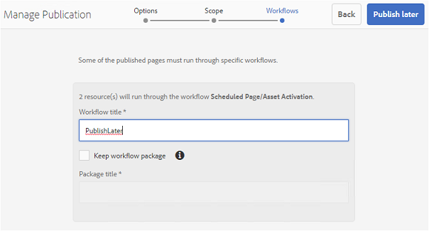
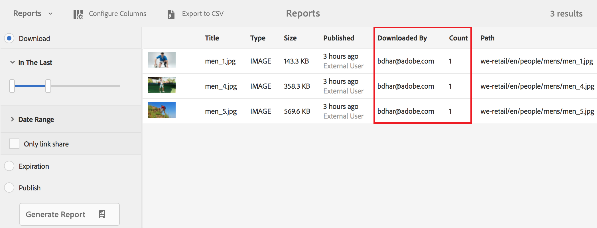
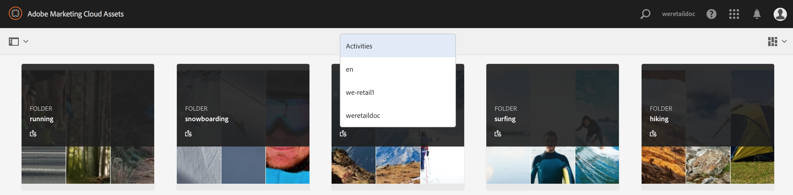

# Novidades do Experience Manager Assets Brand Portal {#what-s-new-in-aem-assets-brand-portal}

O Adobe Experience Manager Assets Brand Portal ajuda você a adquirir, controlar e distribuir com facilidade e segurança os ativos criativos aprovados para terceiros e usuários empresariais internos em todos os dispositivos. Ele ajuda a melhorar a eficiência do compartilhamento de ativos, acelera o tempo de entrada no mercado dos ativos e reduz o risco de não-conformidade e acesso não autorizado. O Adobe está trabalhando para melhorar a experiência geral do Brand Portal. Veja aqui uma prévia dos novos recursos e aprimoramentos.

## O que mudou em 2024.10.0 {#what-changed-in-October-2024}

O Brand Portal 2024.10.0 é uma versão interna que inclui correções para os problemas críticos. Consulte as [Notas de Versão do Brand Portal](brand-portal-release-notes.md) mais recentes.

## O que mudou em 2024.02.0 {#what-changed-in-February-2024}

O Brand Portal 2024.02.0 é uma versão interna que inclui correções para os problemas críticos. Consulte as [Notas de Versão do Brand Portal](brand-portal-release-notes.md) mais recentes.

## O que mudou em 2023.10.0 {#what-changed-in-October-2023}

O Brand Portal 2023.10.0 é uma versão interna que inclui correções para os problemas críticos. Consulte as [Notas de Versão do Brand Portal](brand-portal-release-notes.md) mais recentes.

## O que mudou em 2023.08.0 {#what-changed-in-August-2023}

O Brand Portal 2023.08.0 é uma versão interna que inclui correções para os problemas críticos. Consulte as [Notas de Versão do Brand Portal](brand-portal-release-notes.md) mais recentes.

## O que mudou em 2023.05.0 {#what-changed-in-May-2023}

O Brand Portal 2023.05.0 é uma versão interna que inclui correções para os problemas críticos. Consulte as [Notas de Versão do Brand Portal](brand-portal-release-notes.md) mais recentes.

## O que mudou em 2023.02.0 {#what-changed-in-February-2023}

O Brand Portal 2023.02.0 é uma versão interna que inclui correções para os problemas críticos. Consulte as [Notas de Versão do Brand Portal](brand-portal-release-notes.md) mais recentes.

## O que mudou em 2022.10.0 {#what-changed-in-October-2022}

O Brand Portal 2022.10.0 é uma versão interna que inclui correções para os problemas críticos. Consulte as [Notas de Versão do Brand Portal](brand-portal-release-notes.md) mais recentes.

## O que mudou em 2022.08.0 {#what-changed-in-August-2022}

O Brand Portal 2022.08.0 é uma versão interna que inclui correções para os problemas críticos. Consulte as [Notas de Versão do Brand Portal](brand-portal-release-notes.md) mais recentes.

## O que mudou em 2022.05.0 {#what-changed-in-May-2022}

Agora o Brand Portal executa trabalhos automaticamente a cada doze horas para excluir todos os ativos do Brand Portal publicados no AEM. Como resultado, não é necessário excluir manualmente os ativos na pasta Contribuição para manter o tamanho da pasta abaixo do limite. Você também pode monitorar o status dos trabalhos de exclusão executados automaticamente usando a opção **[!UICONTROL Ferramentas]** > **[!UICONTROL Status de contribuição do ativo]** > **[!UICONTROL Relatórios de exclusão]** no Brand Portal. O relatório de uma tarefa fornece os seguintes detalhes:

* Hora de início do trabalho
* Hora de término do trabalho
* Status do trabalho
* Total de ativos incluídos em um trabalho
* Total de ativos excluídos com êxito em um trabalho
* Armazenamento total disponibilizado como resultado da execução do trabalho

Também é possível fazer drill-down adicional para exibir os detalhes de cada ativo incluído em um job de deleção. Detalhes como título do ativo, tamanho, autor, status de exclusão e tempo de exclusão são incluídos no relatório.

Além disso, o Brand Portal 2022.05.0 inclui correções para os problemas críticos. Consulte as [Notas de Versão do Brand Portal](brand-portal-release-notes.md) mais recentes.

## O que mudou em 2022.02.0 {#what-changed-in-Feb-2022}

O Brand Portal 2022.02.0 é uma versão interna que inclui correções para os problemas críticos. Consulte as [Notas de Versão do Brand Portal](brand-portal-release-notes.md) mais recentes.

## O que mudou em 2021.10.0 {#what-changed-in-october-2021}

O Brand Portal 2021.10.0 é uma versão interna que inclui correções para os problemas críticos. Consulte as [Notas de Versão do Brand Portal](brand-portal-release-notes.md) mais recentes.

## O que mudou em 2021.08.0 {#what-changed-in-august-2021}

O Brand Portal 2021.08.0 é uma versão interna que apresenta perfis empresariais para clientes corporativos e de equipes, a fim de oferecer às organizações melhor controle sobre seus ativos. Os usuários agora têm direito específico da organização nas organizações novas e migradas. Durante a migração, todas as contas existentes do Adobe ID são migradas para as Business IDs.

* IDs de negócios para todas as organizações novas e existentes após a migração.
* As Business IDs não exigem nenhuma configuração específica, como solicitar um domínio ou configurar um SSO.
* É possível adicionar usuários com qualquer endereço de email, incluindo domínios de email públicos, como gmail.com ou outlook.com.

**Impacto nos usuários do Brand Portal**

A migração não afeta seus conjuntos de dados, ativos, usuários existentes ou qualquer configuração. A única alteração interna que ocorre durante a migração é o direito da sua organização existente aos perfis comerciais.

>[!NOTE]
>
>Os perfis empresariais estão atualmente aplicáveis às novas organizações criadas após 16 de agosto de 2021.
>
>Até que sua organização seja migrada, você pode continuar usando os tipos de Adobe ID, Enterprise ID ou Federated ID para acessar a organização.

### Artigos de referência {#reference-articles}

* [Introdução aos perfis de Adobe](https://helpx.adobe.com/enterprise/kb/introducing-adobe-profiles.html)

* [Gerenciar perfis de Adobe](https://helpx.adobe.com/enterprise/using/manage-adobe-profiles.html)

* [Atualização para entrar na experiência para usuários e administradores](https://helpx.adobe.com/enterprise/using/storage-for-business.html#new-admin-sign-in-exp)

* [Restrição de logon durante a migração](https://helpx.adobe.com/enterprise/kb/account-temporarily-unavailable.html)

* [Gerenciar usuários no Admin Console](https://helpx.adobe.com/enterprise/using/manage-users-individually.html)

* [Gerenciar perfis de produto para usuários corporativos](https://helpx.adobe.com/enterprise/using/manage-product-profiles.html#assign-users)

* [Confiança de domínio](https://helpx.adobe.com/enterprise/admin-guide.html/enterprise/using/set-up-identity.html#directory-trusting)

<!--   
### Add new users to T2E organization   {#add-users-to-T2E-org}

On adding a new user in Admin Console for a new or migrated T2E organization, the user will have to perform an additional step **Join Team** to get entitled to the T2E organization. 

The user is entitled only if the user chooses to **Join Team**, otherwise the user won't get access to the selected T2E organization in Brand Portal. 

>[!NOTE]
>
>The workflow is not applicable to the existing Brand Portal users.

### Additional screen while navigating to Admin Console   {#navigate-to-admin-console}

The administrators will have to perform an additional step of selecting the T2E organization while navigating from Brand Portal to Admin Console. The workflow applies on the new and migrated T2E organizations.   

Selection of the T2E organization is a one-time activity and is not required everytime the administrator navigates from Brand Portal to Admin Console.

1. Log in to a T2E organization in Brand Portal as administrator.
1. Go to **[!UICONTROL Tools]** > **[!UICONTROL Users]** > **[!UICONTROL Management]** and click on the link **[!UICONTROL Launch Admin Console]**. 

   Or, go to **[!UICONTROL Unified Shell]** > **[!UICONTROL Administration]** and click on the link **[!UICONTROL Launch Admin Console]**. 
1. Search the T2E organization to login to Admin Console.

   

### Restriction during migration of an organization   {#login-restriction}

When an organization is undergoing T2E migration, the users of that organization will not be able to login to Brand Portal. The following error message appears on the screen. However, the migration won't impact the active user session until the token expires. 

Once the migration is complete, the users can login to Brand Portal. The users will receive an email notification containing the entitlement changes. If the users are entitled to more than one organization, they will have to select the organization at the time of login. 
-->

<!--
For a new or migrated T2E orgnization, the users will have an organization specific entitlement. A user can have multiple entitlements with the same email id for different T2E organizations. 
-->

## O que mudou em 2021.06.0 {#what-changed-in-june-2021}

O Brand Portal 2021.06.0 é uma versão interna que inclui correções para os problemas críticos. Consulte as [Notas de Versão do Brand Portal](brand-portal-release-notes.md) mais recentes.

## O que mudou em 2021.02.0 {#what-changed-in-feb-2021}

O Brand Portal 2021.02.0 aprimora o AEM Assets as a Cloud Service com o fluxo de trabalho de ativação e o recurso de origem de ativos. Ela também melhora a experiência de download de ativos e inclui correções críticas. Ela também permite que os administradores configurem o comportamento de download padrão de pastas, coleções e download em massa de ativos no nível do locatário. O **[!UICONTROL Relatório de uso]** do Brand Portal também foi modificado para refletir os usuários ativos do Brand Portal.

### Ativar o Brand Portal no AEM Assets as a Cloud Service {#bp-automation-on-cloud-service}

O AEM Assets as a Cloud Service agora está qualificado para ter uma instância pré-configurada do Brand Portal. O usuário do Cloud Manager pode ativar o Brand Portal na instância as a Cloud Service do AEM Assets.

Anteriormente, o AEM Assets as a Cloud Service era configurado manualmente com o Brand Portal usando o Adobe Developer Console.

O usuário do Cloud Manager aciona o fluxo de trabalho de ativação que cria as configurações necessárias no back-end e ativa o Brand Portal na mesma organização IMS da instância as a Cloud Service do AEM Assets.

Para ativar o Brand Portal na instância as a Cloud Service do AEM Assets:

1. Faça logon no Adobe Cloud Manager e navegue até **[!UICONTROL Ambientes]**.
1. Selecione os ambientes (um por um) na lista. Depois de encontrar o ambiente associado ao Brand Portal, clique no botão **[!UICONTROL Ativar Brand Portal]** para iniciar o fluxo de trabalho de ativação.
1. Depois que o locatário do Brand Portal é ativado, o status muda para Ativated.

Consulte [ativar o Brand Portal no AEM Assets as a Cloud Service](https://experienceleague.adobe.com/br/docs/experience-manager-cloud-service/content/assets/brand-portal/configure-aem-assets-with-brand-portal).

### Origem de ativos no AEM Assets as a Cloud Service {#asset-sourcing-on-cloud-service}

O recurso Origem de ativos agora está disponível no AEM Assets as a Cloud Service. Por padrão, o recurso é habilitado para todos os usuários do Cloud Service. Os usuários permitidos do Brand Portal podem contribuir para a origem de ativos fazendo o upload de novos ativos para as pastas de contribuição e publicando a pasta de contribuição do Brand Portal para a instância as a Cloud Service do AEM Assets. Os administradores podem revisar e aprovar contribuições de usuários do Brand Portal antes de distribuí-las a outros usuários.

Anteriormente, a Origem de ativos só estava disponível no AEM Assets (no local e no managed service).

Consulte [Origem de ativos no Brand Portal](https://experienceleague.adobe.com/en/docs/experience-manager-brand-portal/using/asset-sourcing-in-brand-portal/brand-portal-asset-sourcing).

### Download de ativo {#asset-download-setting}

Além das **[!UICONTROL Configurações de Download]** existentes, os administradores do Brand Portal agora podem definir a configuração **[!UICONTROL Download de Ativos]**. Essa configuração permite que os administradores controlem o comportamento de download padrão de pastas, coleções e downloads em massa de ativos (mais de 20 ativos) no nível do locatário.

<!--
Earlier, all the asset renditions were directly downloaded in a zip folder in case of folder, collection, and bulk download of assets. As the **[!UICONTROL Download]** dialog box is skipped for folders or collections, there was no mechanism to control the downloading behaviour of the assets. Due to this, the users were finding it difficut to search for a particular asset rendition from a folder containing huge bunch of downloaded renditions. 
-->

Anteriormente, todas as representações de ativos eram baixadas diretamente em uma pasta zip. A caixa de diálogo **[!UICONTROL Download]** foi ignorada para pastas e coleções. E não havia nenhum método para controlar o comportamento de download dos ativos, dificultando a pesquisa de uma representação específica de muitos downloads.

A configuração **[!UICONTROL Download de ativos]** agora fornece uma opção para criar uma pasta separada para cada ativo ao baixar as pastas, coleções ou o download em massa de ativos.

Se a configuração **[!UICONTROL Download de ativos]** estiver desabilitada, as pastas ou coleções serão baixadas em uma pasta zip que contém todas as representações de ativos na mesma pasta, exceto para baixar os ativos usando o link de compartilhamento.

Faça logon no seu locatário do Brand Portal como administrador e navegue até **[!UICONTROL Ferramentas]** > **[!UICONTROL Download]**. Os administradores podem habilitar a configuração **[!UICONTROL Download de ativos]** para criar uma pasta separada para cada ativo ao baixar pastas, coleções e o download de ativos em massa.

Consulte [baixar ativos do Brand Portal](https://experienceleague.adobe.com/en/docs/experience-manager-brand-portal/using/download/brand-portal-download-assets).
<!--
### Download using Share link {#download-using-share-link}

The default behavior of downloading the assets using share link is now independent of the **[!UICONTROL Download Settings]**. A separate folder is created for each asset while downloading the assets using share link. 
-->

### Relatório de uso {#usage-report}

O **[!UICONTROL Relatório de Uso]** do Brand Portal foi modificado para refletir somente os usuários ativos do Brand Portal. Os usuários do Brand Portal que não estão atribuídos a nenhum perfil de produto no Admin Console são considerados usuários inativos e não são refletidos no **[!UICONTROL Relatório de uso]**.

Anteriormente, os usuários ativos e inativos eram mostrados no Relatório de uso.

## O que mudou em 2020.10.0 {#what-changed-in-oct-2020}

O Brand Portal 2020.10.0 é uma versão de aprimoramento que tem como objetivo simplificar a experiência de download de ativos e inclui correções críticas. O aprimoramento introduz um fluxo de trabalho novo e aprimorado para downloads de ativos, com opções para excluir representações e downloads diretos do painel **[!UICONTROL Representações]**. Ele também permite a configuração de direitos de acesso e download para grupos de usuários específicos e fornece navegação fácil para arquivos, coleções e links compartilhados de todas as páginas do Brand Portal. Consulte as [Notas de versão do Brand Portal](brand-portal-release-notes.md).

### Experiência de download simplificada {#download-dialog}

Anteriormente, a caixa de diálogo **[!UICONTROL Baixar]** oferecia várias opções, como criar pastas separadas para cada ativo, enviar ativos por email, selecionar ativos originais e muito mais. Essas opções eram confusas para usuários novos ou não técnicos, especialmente ao baixar vários ativos ou pastas. Além disso, o usuário não podia ver todas as representações de ativos ou excluir uma representação personalizada ou dinâmica específica.

A nova caixa de diálogo **[!UICONTROL Download]** generaliza o processo de seleção e filtragem de ativos, facilitando a tomada de decisões eficazes pelos usuários do Brand Portal ao baixar as representações de ativos. Ele lista todos os ativos selecionados e suas representações, dependendo da configuração de [**[!UICONTROL Download]**](brand-portal-download-assets.md) e das configurações de **[!UICONTROL Download]**.

>[!NOTE]
>
>Todos os usuários agora têm o **[!UICONTROL Download Rápido]** habilitado por padrão e requer o IBM® [Aspera Connect 3.9.9](https://www.ibm.com/support/fixcentral/swg/selectFixes?parent=ibm~Other%20software&amp;product=ibm/Other+software/IBM+Aspera+Connect&amp;release=3.9.9&amp;platform=All&amp;function=all) instalado na extensão de seu navegador antes de baixar os ativos da Brand Portal.

<!--
If any of the **[!UICONTROL Custom Rendition]** or **[!UICONTROL System Rendition]** is enabled in the [**[!UICONTROL Download]**](brand-portal-download-assets.md) configuration and **[!UICONTROL Download]** settings are enabled for the group users, the new **[!UICONTROL Download]** dialog box appears with all the renditions of the selected assets or folders containing assets in a List View. 
-->

Na caixa de diálogo **[!UICONTROL Download]**, os usuários podem:

* Visualize todas as representações disponíveis de qualquer ativo na lista de downloads.
* Exclua as representações dos ativos que não são necessárias para o download.
* Aplique o mesmo conjunto de representações a todos os tipos de ativos semelhantes com um só clique.
* Aplique um conjunto diferente de representações para tipos de ativos diferentes.
* Crie uma pasta separada para cada ativo.
* Baixar ativos selecionados e suas representações.

O fluxo de trabalho de download é consistente para ativos independentes, vários ativos, pastas com ativos, ativos licenciados ou não licenciados e ao baixar ativos por meio de um link compartilhado. Consulte [etapas para baixar ativos do Brand Portal](https://experienceleague.adobe.com/en/docs/experience-manager-brand-portal/using/download/brand-portal-download-assets).

### Navegação rápida {#quick-navigation}

Anteriormente, a opção de exibir **[!UICONTROL Arquivos]**, **[!UICONTROL Coleções]** e **[!UICONTROL Links Compartilhados]** estava oculta e exigia vários cliques toda vez que o usuário desejava mudar para outra exibição.

No Brand Portal 2020.10.0, os usuários podem navegar para **[!UICONTROL Arquivos]**, **[!UICONTROL Coleções]** e **[!UICONTROL Links Compartilhados]** de todas as páginas do Brand Portal com um só clique usando os links de navegação rápida.

### Painel de representação aprimorado {#rendition-panel}

Anteriormente, os usuários só podiam exibir o ativo original e suas representações no painel **[!UICONTROL Representações]** se qualquer uma das **[!UICONTROL Representações Personalizadas]** ou **[!UICONTROL Representações do Sistema]** estivesse habilitada na configuração **[!UICONTROL Download]**. Além disso, os usuários precisavam baixar todas as representações de ativos, pois não havia filtro para excluir representações personalizadas ou dinâmicas específicas que não fossem necessárias.

<!--
Earlier, if any of the custom or system renditions was enabled in the **[!UICONTROL Download]** settings, an additional **[!UICONTROL Download]** dialog box appeared on clicking the **[!UICONTROL Download]** button wherein the user had to manually select the set of renditions (original asset, custom renditions, dynamic renditions) to download.
There was no filter to exclude specific custom or dynamic renditions which were not required for download.
-->

No Brand Portal 2020.10.0, os usuários podem excluir representações específicas e [baixar diretamente as representações selecionadas no painel Representações](brand-portal-download-assets.md#download-assets-from-asset-details-page) na página de detalhes do ativo sem precisar abrir a caixa de diálogo **[!UICONTROL Download]**.

<!-- 
In Brand Portal 2020.10.0, direct download and exclude renditions features are introduced in the **[!UICONTROL Renditions]** panel on the asset details page. All the renditions (original asset, custom renditions, dynamic renditions) under the rendition panel are now associated with a check box and are enabled by default. 

The user can clear the check boxes to exclude the renditions which are not required for download. And can click on the **[!UICONTROL Download]** button in the **[!UICONTROL Renditions]** panel to directly download the selected set of renditions in a zip folder without having to open the **[!UICONTROL Download]** dialog box.
-->

### Definir configurações de download {#download-permissions}

Os administradores do Brand Portal agora podem definir configurações para grupos de usuários para exibir ou baixar ativos e representações originais, ou ambos, na página de detalhes do ativo, além das configurações existentes do **[!UICONTROL Download]**.

Faça logon no seu locatário do Brand Portal como administrador e navegue até **[!UICONTROL Ferramentas]** > **[!UICONTROL Usuários]**.

Na página **[!UICONTROL Funções de usuário]**, navegue até a guia **[!UICONTROL Grupos]** para definir as configurações de exibição e/ou download para os grupos de usuários.

Anteriormente, as configurações estavam disponíveis apenas para impedir que os usuários do grupo baixassem o ativo original.

A guia **[!UICONTROL Grupos]** na página **[!UICONTROL Funções de Usuário]** permite que os administradores definam as configurações de exibição e download:

* Se as configurações **[!UICONTROL Baixar original]** e **[!UICONTROL Baixar representações]** estiverem ativadas, os usuários do grupo selecionado poderão exibir e baixar os ativos originais e suas representações.
* Se ambas as configurações estiverem desativadas, os usuários só poderão exibir os ativos originais. As representações de ativos não estão visíveis para os usuários na página de detalhes do ativo.
* Se somente a configuração **[!UICONTROL Baixar original]** estiver ativada, os usuários poderão exibir e baixar somente os ativos originais da página de detalhes do ativo.
* Se apenas a configuração **[!UICONTROL Baixar representações]** estiver ativada, os usuários poderão exibir o ativo original, mas não poderão baixá-lo. No entanto, o usuário pode visualizar e baixar as representações do ativo.

Consulte [configurar o download do ativo](https://experienceleague.adobe.com/en/docs/experience-manager-brand-portal/using/download/brand-portal-download-assets#configure-download-permissions).

>[!NOTE]
>
>Se um usuário for adicionado a vários grupos e se um desses grupos tiver restrições, as restrições se aplicam ao usuário.

<!--
>Restrictions to access the original asset and their renditions do not apply to administrators even if they are members of restricted groups.
 >
 >The users can always download assets and their renditions from the repository using a `curl` request even if the download configurations are turned-off.
 >
-->

## O que mudou na versão 6.4.7 {#what-changed-in-647}

A versão 6.4.7 do Brand Portal traz o Visualizador de documentos, melhora a experiência de download de ativos e inclui correções críticas. Consulte as [Notas de Versão do Brand Portal](brand-portal-release-notes.md) mais recentes.

<!--
Brand Portal 6.4.7 release brings in the Document Viewer, leverages the Brand Portal administrators to configure asset download, and centers top customer requests. See latest [Brand Portal Release Notes](brand-portal-release-notes.md).
-->

### Visualizador de documentos {#doc-viewer}

O Visualizador de documentos melhora a experiência de visualização de PDF. Ele fornece uma experiência semelhante à do Adobe Document Cloud ao visualizar os arquivos PDF no Brand Portal.

Anteriormente, opções limitadas estavam disponíveis para visualizar os arquivos PDF.

Os usuários do Brand Portal podem usar o Visualizador de documentos para exibir páginas e marcadores, pesquisar texto, aumentar e diminuir o zoom e navegar pelas páginas. Eles podem alternar para uma página específica, ajustar a uma janela ou tela e alternar a visibilidade da barra de ferramentas.

>[!NOTE]
>
>A experiência de exibição para outros formatos de documento permanece inalterada.

### Baixar experiência {#download-configurations}

O processo de download de ativos foi renovado, proporcionando uma experiência de usuário simplificada ao [baixar ativos do Brand Portal](brand-portal-download-assets.md).

O fluxo de trabalho existente de download de ativos do Brand Portal é inevitavelmente seguido pela aparência de uma caixa de diálogo **[!UICONTROL Download]** com várias opções de download para escolher.

No Brand Portal 6.4.7, os administradores do Brand Portal podem definir as configurações do ativo **[!UICONTROL Download]**. As configurações disponíveis são:

* **[!UICONTROL Download Rápido]**
* **[!UICONTROL Representações Personalizadas]**
* **[!UICONTROL Representações do Sistema]**

O administrador do Brand Portal pode habilitar qualquer combinação para configurar o download de ativos.

<!--In Brand Portal 6.4.7, fast download, custom renditions, and system renditions are the three configurations available.-->

* Se as configurações **[!UICONTROL Representações personalizadas]** e **[!UICONTROL Representações do sistema]** estiverem desativadas, as representações originais dos ativos serão baixadas sem nenhuma caixa de diálogo adicional, o que simplifica a experiência de download para os usuários do Brand Portal.

* Se qualquer uma das **[!UICONTROL Representações personalizadas]** ou **[!UICONTROL Representações do sistema]** estiver habilitada, a caixa de diálogo **[!UICONTROL Download]** será exibida e o ativo original junto com as representações do ativo será baixado. A habilitação da configuração de **[!UICONTROL Download Rápido]** acelera o processo de download.

Com base na configuração, o fluxo de trabalho de download permanece constante para ativos independentes, vários ativos e pastas que contêm ativos. Também inclui ativos licenciados ou não licenciados e o download de ativos usando um link de compartilhamento.

## O que mudou na versão 6.4.6 {#what-changed-in-646}

No Brand Portal 6.4.6, o canal de autorização entre o AEM Assets e o Brand Portal é alterado. O Brand Portal agora é compatível com o AEM Assets as a Cloud Service, AEM Assets 6.3 e superior. No AEM Assets 6.3 e posterior, o Brand Portal foi configurado inicialmente na interface clássica usando o gateway OAuth herdado. Esse gateway emprega a troca de tokens JWT para obter um token de acesso IMS para autorização. Agora o AEM Assets está configurado com o Brand Portal por meio do Adobe Developer Console, que obtém um token IMS para autorização do locatário do Brand Portal.

<!-- The steps to configure integration are different depending on your AEM version, and whether you are configuring for the first-time, or upgrading the existing integration:
-->

<!--
  
   | **AEM Version** |**New Integration** |**Upgrade Integration** |
|---|---|---|
| **AEM 6.5** |[Create new integration](../using/brand-portal-configure-integration-65.md) |[Upgrade existing integration](../using/brand-portal-configure-integration-65.md#upgrade-integration-65) | 
| **AEM 6.4** |[Create new integration](../using/brand-portal-configure-integration-64.md) |[Upgrade existing integration](../using/brand-portal-configure-integration-64.md#upgrade-integration-64) | 
| **AEM 6.3** |[Create new integration](../using/brand-portal-configure-integration-63.md) |[Upgrade existing integration](../using/brand-portal-configure-integration-63.md#upgrade-integration-63) | 
| **AEM 6.2** | | 

   -->

As etapas para configurar o AEM Assets com Brand Portal são diferentes, dependendo da versão do AEM e se você estiver configurando pela primeira vez ou atualizando as configurações existentes:

<!--| **AEM Version** |**New Configuration** |**Upgrade Configuration** |
|---|---|---|
| **AEM 6.5 (6.5.4.0 and above)** |[Create configuration](../using/brand-portal-configure-integration-65.md) |[Upgrade configuration](../using/brand-portal-configure-integration-65.md#upgrade-integration-65) | 
| **AEM 6.4 (6.4.8.0 and above)** |[Create configuration](../using/brand-portal-configure-integration-64.md) |[Upgrade configuration](../using/brand-portal-configure-integration-64.md#upgrade-integration-64) | 
| **AEM 6.3 (6.3.3.8 and above)** |[Create configuration](../using/brand-portal-configure-integration-63.md) |[Upgrade configuration](../using/brand-portal-configure-integration-63.md#upgrade-integration-63) | 

-->

<!-- AEM Assets configuration with Brand Portal on Adobe I/O is supported on:
* AEM 6.5.4.0 and above
* AEM 6.4.8.0 and above
* AEM 6.3.3.8 and above -->

| **Versão do AEM** | **Nova configuração** | **Atualizar Configuração** |
|---|---|---|
| **AEM Assets as a Cloud Service** | [Criar configuração](https://experienceleague.adobe.com/br/docs/experience-manager-cloud-service/content/assets/brand-portal/configure-aem-assets-with-brand-portal) | - |
| **AEM 6.5 (6.5.4.0 e posterior)** | [Criar configuração](https://experienceleague.adobe.com/br/docs/experience-manager-65/content/assets/brandportal/configure-aem-assets-with-brand-portal) | [Configuração de atualização](https://experienceleague.adobe.com/en/docs/experience-manager-65/content/assets/brandportal/configure-aem-assets-with-brand-portal#upgrade-integration-65) |

>[!NOTE]
>
>A Adobe recomenda atualizar sua instância AEM para usar o service pack mais recente.

Consulte as [Notas de versão do Brand Portal](brand-portal-release-notes.md).

Consulte as [Perguntas frequentes sobre o Brand Portal](brand-portal-faqs.md).

## O que mudou na versão 6.4.5 {#what-changed-in-645}

O Brand Portal 6.4.5 permite que agências e equipes externas façam upload de conteúdo no Brand Portal e o publiquem no AEM Assets, tudo sem precisar acessar o ambiente do autor. Este recurso é chamado de **[Origem de ativos no Brand Portal](brand-portal-asset-sourcing.md)** e melhora a experiência do cliente fornecendo um mecanismo bidirecional para que os usuários contribuam e compartilhem ativos com outros usuários globais do Brand Portal.

### Origem de ativos no Brand Portal {#asset-sourcing-in-bp}

A Origem de ativos permite que os usuários do AEM (administradores/usuários não administradores) criem pastas com uma propriedade extra **Contribuição de ativos**, garantindo que a nova pasta seja criada e aberta para o envio de ativos por usuários do Brand Portal. Ele aciona automaticamente um fluxo de trabalho que cria duas subpastas adicionais, chamadas NEW e SHARED, na pasta **Contribution** recém-criada.

O usuário do AEM carrega um ativo breve e de linha de base para a pasta **SHARED**. Eles definem os tipos de ativos necessários na pasta de contribuição, garantindo que os usuários do Brand Portal tenham as informações de referência necessárias. O administrador pode conceder aos usuários ativos do Brand Portal acesso à pasta de contribuição antes de publicar a pasta **Contribuição** recém-criada na Brand Portal.

Quando o usuário terminar de adicionar conteúdo à pasta **NOVO**, ele poderá publicar a pasta de contribuição de volta no ambiente de autor do AEM. Pode levar alguns minutos para concluir a importação e refletir o conteúdo recém-publicado no AEM Assets.

Além disso, todas as funcionalidades existentes permanecem inalteradas. Os usuários do Brand Portal podem exibir, pesquisar e baixar ativos da pasta contribuição e de outras pastas permitidas. Além disso, os administradores podem compartilhar a pasta de contribuição, modificar propriedades e adicionar ativos a coleções.

>[!NOTE]
>
>A origem de ativos no Brand Portal é compatível com o AEM 6.5.2.0 e superior.
>
>O recurso não é compatível com as versões anteriores, AEM 6.3 e AEM 6.4.

### Fazer upload de ativos para a pasta de contribuição {#upload-assets-in-bp}

Os usuários do Brand Portal com permissões apropriadas podem fazer upload de ativos ou pastas individuais (arquivo .zip) contendo vários ativos para a pasta de contribuição. Um usuário pode fazer upload de vários ativos para uma pasta de contribuição de ativos. No entanto, somente uma pasta pode ser criada de cada vez.

Os usuários do Brand Portal só podem carregar ativos para a subpasta **NEW**. A pasta **SHARED** destina-se à distribuição de requisitos e ativos de linha de base.

### Pasta de contribuição do Publish para o AEM Assets {#publish-assets-to-aem}

Quando o carregamento for concluído para a pasta **NEW**, os usuários do Brand Portal poderão publicar a pasta de contribuição de volta para AEM. Pode levar alguns minutos para importar e refletir o conteúdo/ativos publicados no AEM Assets. Consulte [publicar pasta de contribuição para o AEM Assets](brand-portal-publish-contribution-folder-to-aem-assets.md).

## O que mudou na versão 6.4.4 {#what-changed-in-644}

A versão do Brand Portal 6.4.4 se concentra em melhorias na pesquisa de texto e nas solicitações dos principais clientes. Consulte as [Notas de Versão do Brand Portal](brand-portal-release-notes.md) mais recentes.

### Aprimoramentos de pesquisa

O Brand Portal 6.4.4 em diante oferece suporte à pesquisa de texto parcial no Predicado de propriedade no painel de filtragem. Para permitir pesquisa de texto parcial, habilite **Pesquisa parcial** no Predicado de propriedade no formulário de pesquisa.

Leia para saber mais sobre pesquisa de texto parcial e pesquisa com curinga.

#### Pesquisa de frase parcial {#partial-phrase-search}

Agora é possível pesquisar ativos especificando apenas uma parte, ou seja, uma ou duas palavras, da frase pesquisada no painel de filtragem.

**Caso de uso**
A pesquisa de frase parcial é útil quando você não tem certeza da combinação exata de palavras que ocorrem na frase pesquisada.

Por exemplo, se o formulário de pesquisa no Brand Portal usa o Predicado de propriedade para pesquisa parcial no título de ativos, especificar o termo **camp** retornará todos os ativos com a palavra camp na frase de título.

#### Pesquisa com curinga {#wildcard-search}

O Brand Portal permite usar o asterisco (&#42;) com parte de uma palavra na consulta de pesquisa.

Se você não tiver certeza das palavras exatas que ocorrem na frase pesquisada, poderá usar uma pesquisa com curinga para preencher as lacunas na consulta de pesquisa.

Por exemplo, especificar **climb&#42;** retorna todos os ativos com palavras que começam com os caracteres **climb** na frase de título se o formulário de pesquisa no Brand Portal usar o Predicado de propriedade para pesquisa parcial no título de ativos.

Da mesma forma, especificando:

* **&#42;climb** retorna todos os ativos que têm palavras que terminam com os caracteres **climb** na frase de título.

* **&#42;climb&#42;** retorna todos os ativos que contêm palavras que compõem os caracteres **climb** na frase de título.

>[!NOTE]
>
>Ao marcar a caixa de seleção **Pesquisa parcial**, **Ignorar maiúsculas e minúsculas** é selecionado por padrão.

## O que mudou na versão 6.4.3 {#what-changed-in}

O Brand Portal 6.4.3 apresenta um alias alternativo para URLs de acesso, uma nova hierarquia de pastas e aprimoramentos de suporte de vídeo. Ele também apresenta publicações agendadas do AEM Author para a Brand Portal, melhorias operacionais e atende às solicitações dos clientes.

### Navegação da hierarquia de pastas para não administradores

Agora, os administradores podem configurar como as pastas são exibidas para usuários não administradores (Editores, Visualizadores e Usuários convidados) no logon. A configuração [Habilitar Hierarquia de Pasta](../using/brand-portal-general-configuration.md) foi adicionada em **Configurações Gerais**, no painel de ferramentas administrativas. Se a configuração for:

* **habilitado**, a árvore de pastas que começa na pasta raiz está visível para usuários não administradores. Assim, concedendo a eles uma experiência de navegação semelhante aos administradores.
* **desabilitado**, somente as pastas compartilhadas são exibidas na página de aterrissagem.

A funcionalidade [Habilitar Hierarquia de Pasta](../using/brand-portal-general-configuration.md) (quando habilitada) ajuda a diferenciar as pastas com os mesmos nomes compartilhados de hierarquias diferentes. Ao fazer logon, os usuários não administradores agora veem as pastas principais virtuais (e ancestrais) das pastas compartilhadas.

As pastas compartilhadas são organizadas nos respectivos diretórios em pastas virtuais. Você pode reconhecer essas pastas virtuais com um ícone de cadeado.

A miniatura padrão das pastas virtuais é a imagem em miniatura da primeira pasta compartilhada.

### Pesquisar em um caminho ou hierarquia de pasta específica

O predicado **Navegador de caminho** foi introduzido no formulário de pesquisa para permitir a pesquisa de ativos em um diretório específico. O caminho de pesquisa padrão do predicado de pesquisa para o Navegador de Caminho é `/content/dam/mac/<tenant-id>/`, que pode ser configurado ao editar o formulário de pesquisa padrão.

* Os usuários administradores podem usar o Navegador de caminhos para navegar para qualquer diretório de pastas no Brand Portal.
* Usuários não administradores podem usar o Navegador de caminho para navegar somente até as pastas (e navegar de volta até as pastas principais) compartilhadas com eles.

  Por exemplo, `/content/dam/mac/<tenant-id>/folderA/folderB/folderC` é compartilhado com um usuário não administrador. O usuário pode pesquisar ativos na folderC usando o Navegador de caminho. Esse usuário também pode navegar para a pasta B e a pasta A (já que são antecessores da pasta C compartilhada com o usuário).

Agora é possível restringir a pesquisa de ativos em uma pasta específica para a qual você navegou, em vez de começar na pasta raiz.

A pesquisa nessas pastas retorna resultados somente dos ativos que foram compartilhados com o usuário.

### Suporte a representações de vídeo do Dynamic Media

Os usuários cuja instância de autor do AEM está no modo híbrido do Dynamic Media podem pré-visualizar e baixar as representações do Dynamic Media, além dos arquivos de vídeo originais.

Para habilitar a visualização e o download de representações de mídia dinâmica em contas de locatário específicas, os administradores especificam uma **Configuração do Dynamic Media**. Esta etapa inclui a URL do serviço de vídeo e a ID de registro na configuração do **Vídeo** do painel de ferramentas administrativas.

Os vídeos do Dynamic Media podem ser visualizados em:

* Página de detalhes do ativo
* Exibição de cartão do ativo
* Página de visualização do compartilhamento de link

Os códigos de vídeo do Dynamic Media podem ser baixados de:

* Brand Portal
* Link compartilhado

### Publicação agendada no Brand Portal

O fluxo de trabalho de publicação do Assets (e pastas) da instância do autor do AEM 6.4.2.0 para o Brand Portal pode ser agendado para data e hora posteriores.

Da mesma forma, os ativos publicados podem ser removidos do portal posteriormente agendando o fluxo de trabalho Desfazer publicação no Brand Portal.

### Alias de locatário configurável no URL

As organizações podem personalizar o URL do portal tendo um prefixo alternativo no URL. Para obter um alias para o nome do locatário no URL do portal existente, as organizações devem entrar em contato com o Suporte ao cliente.

Somente o prefixo do URL do Brand Portal pode ser personalizado, e não o URL inteiro.\
Por exemplo, uma organização com um domínio existente **geomettrix.brand-portal.adobe.com** pode obter **geomettrixinc.brand-portal.adobe.com** criado mediante solicitação.

No entanto, a instância do Autor AEM pode ser [configurada](https://experienceleague.adobe.com/br/docs/experience-manager-65/content/assets/brandportal/configure-aem-assets-with-brand-portal) somente com a URL da ID do locatário e não com a URL do alias do locatário (alternativo).

As organizações podem atender às suas necessidades de marca, obtendo o URL do portal personalizado, em vez de aderir ao URL fornecido pelo Adobe.

### Baixar aprimoramentos de experiência

A versão oferece uma experiência de download simplificada com um número reduzido de cliques e avisos, em:

* Optar por baixar somente as representações (e não os ativos originais).
* Baixar os ativos quando o acesso às representações originais for restrito.

## O que mudou na versão 6.4.2 {#what-changed-in-1}

O Brand Portal 6.4.2 apresenta recursos para atender às necessidades de distribuição de ativos das organizações, permitindo alcance global por meio do acesso de visitantes e downloads mais rápidos. Ele também oferece controle aprimorado com novas configurações de administrador, um relatório adicionado e atende às solicitações do cliente.

### Acesso de convidado

O AEM Brand Portal permite acesso de convidado ao portal. Um Usuário Convidado não requer credenciais para entrar no portal e pode acessar e baixar todas as pastas e coleções públicas. Os usuários convidados podem adicionar ativos à lightbox (coleção privada) e baixar os mesmos. Eles também podem exibir a pesquisa inteligente de tags e pesquisar predicados definidos pelos administradores. A sessão de convidado não permite que os usuários criem coleções e pesquisas salvas ou as compartilhem ainda mais, acessem configurações de pasta e coleções e compartilhem ativos como links.

Em uma organização, várias sessões simultâneas de convidado são permitidas, o que é limitado a 10% da cota total de usuários por organização.

Uma sessão de convidado permanece ativa por duas horas. Portanto, o estado da lightbox também é preservado até duas horas após o horário de início da sessão. Após duas horas, a sessão de convidado tem que ser reiniciada, então o estado lightbox é perdido.

### Downloads acelerados

Os usuários da Brand Portal podem aplicar downloads rápidos baseados no IBM® Aspera Connect para obter velocidades até 25 vezes mais rápidas e uma experiência de download contínua, independentemente da sua localização no mundo. Para baixar os ativos mais rapidamente do Brand Portal ou do link compartilhado, os usuários precisam selecionar a opção **Habilitar aceleração de download** na caixa de diálogo de download, desde que a aceleração de download esteja habilitada em suas organizações.

Para habilitar o download acelerado baseado no IBM® Aspera para a organização, a opção de administradores **Habilitar aceleração de download** (que está desabilitada por padrão) em [Configurações gerais](brand-portal-general-configuration.md#allow-download-acceleration) no painel de ferramentas administrativas.

Para obter os pré-requisitos e as etapas de solução de problemas para baixar arquivos de ativos mais rapidamente da Brand Portal e de links compartilhados, consulte o [Guia para acelerar downloads da Brand Portal](../using/accelerated-download.md#main-pars-header).

### Relatório de logons de usuário

Um novo relatório para rastrear os logons de usuário foi introduzido. O relatório **Logons de Usuário** pode ser fundamental para permitir que as organizações auditem e mantenham uma verificação dos administradores delegados e outros usuários do Brand Portal.

O relatório registra os nomes de exibição, IDs de email, personas (administrador, visualizador, editor, convidado), grupos, último logon, status da atividade e contagem de logon de cada usuário da implantação do Brand Portal 6.4.2 até o momento da geração do relatório. Os administradores podem exportar o relatório como .csv. Junto com outros relatórios, o relatório Logons de usuário permite que as organizações monitorem atentamente as interações do usuário com os recursos de marca aprovados, garantindo a conformidade com os escritórios de conformidade corporativa.

### Acesso às representações originais

Os administradores podem restringir o acesso a arquivos de imagem originais e fornecer acesso a representações de baixa resolução para download no Brand Portal ou em links compartilhados. Esse acesso pode ser controlado no nível do grupo de usuários na guia Grupos da página Funções do usuário.

* Por padrão, todos os usuários podem baixar representações originais, já que o Acesso ao Original está ativado para todos.
* Os administradores precisam desmarcar as respectivas caixas de seleção para impedir que um grupo de usuários acesse as representações originais.
* Se um usuário for membro de vários grupos, mas apenas um dos grupos tiver restrições, as restrições se aplicam a esse usuário.
* As restrições não se aplicam aos administradores, mesmo que sejam membros de grupos restritos.
* As permissões do usuário que está compartilhando ativos como link se aplicam aos usuários que baixam ativos usando links compartilhados.

### Caminho de hierarquia de pastas em visualizações de cartão e lista

Os cartões de pastas, na Exibição de cartão, agora exibem informações de hierarquia de pastas para usuários não administradores (Editor, Visualizador e Usuário convidado). Essa funcionalidade permite que os usuários saibam o local das pastas que estão acessando com relação à hierarquia principal.

As informações de hierarquia de pastas são particularmente úteis na diferenciação das pastas. Ou seja, pasta com nomes semelhantes a outras pastas compartilhadas de uma hierarquia de pastas diferente. Se os usuários não administradores não estiverem cientes da estrutura de pastas dos ativos compartilhados com eles, ativos/pastas com nomes semelhantes parecem confusos.

* Os caminhos mostrados nas respectivas placas estão truncados para se ajustarem aos tamanhos da placa. No entanto, os usuários podem ver o caminho completo como uma dica de ferramenta, passando o cursor do mouse sobre o caminho truncado.

A Exibição de lista mostra uma pasta Caminho dos ativos em uma coluna para todos os usuários do Brand Portal.

### Opção de visão geral para exibir as propriedades do ativo

O Brand Portal fornece uma opção de Visão geral para usuários não administradores (Editores, Visualizadores, Usuários convidados) para visualizar Propriedades de ativos de ativos/pastas selecionadas. A opção Visão geral está visível:

1. Na barra de ferramentas, na parte superior, em selecione um ativo/pasta.
2. Na lista suspensa, em selecione o Seletor de painéis.

Ao selecionar a opção Visão geral, enquanto um ativo/pasta é selecionado, os usuários podem ver o título, o caminho e a hora da criação do ativo. Enquanto na página de detalhes do ativo, selecionar a opção Visão geral permite que os usuários vejam os metadados do ativo.

## Novas configurações

Seis novas configurações são adicionadas para que os administradores ativem ou desativem as seguintes funcionalidades em locatários específicos:

* Permitir acesso de convidado
* Permitir que os usuários solicitem acesso ao Brand Portal
* Permitir que administradores excluam ativos da Brand Portal
* Permitir criação de coleções públicas
* Permitir criação de coleções públicas inteligentes
* Permitir aceleração de download

As configurações acima estão disponíveis nas configurações Acesso e Geral, no painel Ferramentas administrativas.

### Interface do usuário do `Adobe I/O` para configurar integrações oAuth

O Brand Portal 6.4.2 em diante usa a interface OAuth (`https://legacy-oauth.cloud.adobe.io/`) herdada para criar o aplicativo JWT, que permite configurar integrações oAuth para permitir a integração do AEM Assets com o Brand Portal. Anteriormente, a interface para configurar integrações OAuth era hospedada em `https://marketing.adobe.com/developer/`. Para saber mais sobre a integração do AEM Assets com o Brand Portal para publicação de ativos e coleções no Brand Portal, consulte [Configurar a integração do AEM Assets com o Brand Portal](https://experienceleague.adobe.com/br/docs/experience-manager-65/content/assets/brandportal/configure-aem-assets-with-brand-portal).

## Aprimoramentos de pesquisa

Os administradores podem fazer com que os predicados de propriedade não diferenciem maiúsculas de minúsculas usando o Predicado de propriedade atualizado, que tem uma marca de seleção para Ignorar maiúsculas e minúsculas. Essa opção está disponível para o Predicado de propriedades e o Predicado de propriedades de vários valores.\
No entanto, a pesquisa que não diferencia maiúsculas de minúsculas é comparativamente mais lenta do que a pesquisa padrão para o Predicado de propriedade. Se houver muitos predicados que não diferenciam maiúsculas de minúsculas no filtro de pesquisa, a pesquisa poderá ficar lenta. A Adobe recomenda usar a pesquisa que não diferencia maiúsculas de minúsculas criteriosamente.

## O que mudou na versão 6.4.1 {#what-changed-in-2}

O Brand Portal 6.4.1 é uma versão de atualização da plataforma. Ele apresenta vários novos recursos e aprimoramentos vitais, como navegação, pesquisa e aprimoramentos de desempenho.

### Aprimoramentos de navegação

* O novo painel Árvore de conteúdo permite que os usuários naveguem rapidamente em uma hierarquia de ativos.

* Novos atalhos de teclado, por exemplo _(p)_ para navegação na página de propriedades, _(e)_ para edição e _(ctrl+c)_ para operações de cópia.
* Experiência de carregamento lento e com rolagem aprimorada na Exibição de cartão e lista para navegar em um grande número de ativos.
* Visualização de cartão aprimorada com suporte para cartões de tamanhos diferentes com base na configuração de visualização.

* A Exibição de cartão agora exibe um carimbo de data/hora ao passar o mouse sobre o rótulo de data.

* A exibição de Coluna aprimorada com **Mais detalhes** no instantâneo de ativo, que permite navegar até a página de detalhes de um ativo.

* Por padrão, a Exibição em lista agora exibe nomes de arquivos de ativos na primeira coluna. Ele também exibe informações sobre local, tipo de ativo, dimensões, tamanho, classificação e publicação. As novas **Configurações de Exibição** podem ser usadas para configurar a quantidade de detalhes a serem exibidos na Exibição de Lista.

* Experiência de detalhes de ativos aprimorada com a capacidade de navegar para frente e para trás entre ativos usando novos botões de navegação e visualizar a contagem de ativos.

* Novo recurso para visualizar arquivos de áudio, carregados do AEM, na página de detalhes do ativo.
* Novo recurso Assets relacionado fornecido em Propriedades do ativo. Os ativos relacionados publicados no Brand Portal a partir do AEM agora mantêm seus relacionamentos, com links para esses ativos relacionados disponíveis na página de propriedades.
* Foi introduzida uma nova configuração para impedir que usuários não administradores criem coleções públicas. As organizações podem trabalhar com a equipe de suporte ao cliente para configurar esse recurso em contas específicas.

### Aprimoramentos de pesquisa

* Recurso introduzido para retornar à mesma posição nos resultados da pesquisa, após navegar até um item de pesquisa, sem executar a consulta de pesquisa novamente.
* Uma nova contagem de resultados de pesquisa para exibir o número de resultados de pesquisa foi fornecida.
* O Filtro aprimorado de pesquisa de tipo de arquivo agora permite filtrar os resultados de pesquisa por tipos MIME específicos, como .jpg, .png e .psd, em vez de apenas categorias amplas, como Imagens, Documentos e Multimídia.
* Filtros de pesquisa aprimorados para coleções, com carimbos de data e hora precisos em vez da funcionalidade do controle deslizante de hora anterior.
* Foram introduzidos novos filtros do tipo Acesso para pesquisar pelas coleções que são Públicas ou não Públicas.

### Otimizações de download

* Um único arquivo grande é baixado diretamente, sem a criação de um arquivo zip, melhorando a velocidade e a taxa de transferência.
* O limite de download por tamanho de arquivo para o recurso de compartilhamento de link é de **1** GB.

* Agora, os usuários podem optar por baixar somente os arquivos personalizados e originais e evitar representações predefinidas ao baixar ativos do Brand Portal ou por meio do recurso de links compartilhados.

### Aprimoramentos de desempenho

* Até 100% de melhoria na velocidade de download de ativos.
* Até 40% de melhoria na resposta de pesquisa de ativos.
* Desempenho de navegação até 40% melhor.

**Observação**: as melhorias mencionadas correspondem aos testes realizados no laboratório.

### Recursos aprimorados de relatórios

**Relatório de compartilhamento de links introduzido**
Um novo relatório, para fornecer informações sobre links compartilhados, foi introduzido. O relatório Compartilhamento de links lista todos os URLs dos ativos compartilhados com usuários internos e externos. Ele emite relatórios para usuários em toda a organização no intervalo de tempo especificado. Também informa quando o link foi compartilhado, por quem e quando expira.

**Ponto de entrada modificado para acessar o Relatório de Uso**
O Relatório de uso agora está consolidado com outros relatórios e pode ser visualizado no console Relatórios de ativos. Para acessar o console Relatórios de ativos, navegue até **Criar/gerenciar relatórios** no painel de ferramentas administrativas.

**Uma experiência de usuário aprimorada para relatórios**
A interface de relatórios no Brand Portal tornou-se mais intuitiva e oferece maior controle às organizações. Além de criar vários relatórios, os administradores agora podem revisitar os relatórios gerados e baixá-los ou excluí-los, pois esses relatórios são salvos no Brand Portal.

Cada um dos relatórios que estão sendo criados pode ser personalizado adicionando ou removendo colunas padrão. Além disso, colunas personalizadas podem ser adicionadas aos relatórios de Download, Expiração e Publish para controlar seu grau de granularidade.

### Ferramentas administrativas aprimoradas

Aprimoramento do Seletor de propriedades nas Ferramentas de administração para metadados, pesquisa e relatórios com recurso de digitação antecipada e navegação para simplificar a experiência de administração.

### Outras melhorias

* O Assets publicado no Brand Portal a partir do AEM 6.3.2.1 e 6.4 agora pode ser disponibilizado publicamente ao marcar a caixa Pasta pública do Publish na caixa de diálogo Replicação do AEM Assets Brand Portal.

* Os administradores são notificados por meio de emails de solicitação de acesso, além das notificações na área de notificação do Brand Portal, se alguém tiver solicitado acesso ao Brand Portal.

## O que mudou na versão 6.3.2 {#what-changed-in-3}

O Brand Portal 6.3.2 inclui funcionalidades novas e aprimoradas voltadas para as principais solicitações do cliente e melhorias gerais de desempenho.

### Solicitar acesso ao Brand Portal {#request-access-to-brand-portal}

Agora os usuários podem solicitar acesso ao Brand Portal usando o novo recurso **acesso necessário** disponível na tela de logon do Brand Portal.

Se os usuários tiverem uma Adobe ID ou precisarem criar uma Adobe ID, eles poderão seguir o fluxo de trabalho apropriado para enviar uma solicitação. Os administradores de produtos da Brand Portal recebem essas solicitações na área de notificação e concedem acesso por meio da Adobe Admin Console.

Para obter mais informações, consulte [Solicitar acesso ao Brand Portal](../using/brand-portal.md#requestaccesstobrandportal).

### Aprimoramento no relatório de download de ativos {#enhancement-in-the-assets-downloaded-report}

O relatório Ativos baixados agora inclui a contagem de download de ativos por usuário dentro do intervalo de data e hora especificado. Os usuários podem baixar esse relatório no formato .csv para compilar dados como a contagem total de downloads de um ativo licenciado.

Para obter mais informações, consulte as Etapas 3 e 6 em [Criar e gerenciar relatórios adicionais](../using/brand-portal-reports.md#createandmanageadditionalreports).

### Notificação de manutenção do Brand Portal {#brand-portal-maintenance-notification}

O Brand Portal agora exibe um banner de notificação alguns dias antes de uma atividade de manutenção futura. Um exemplo de notificação:

Para obter mais informações, consulte a [notificação de manutenção do Brand Portal](https://experienceleague.adobe.com/en/docs/experience-manager-brand-portal/using/introduction/brand-portal).

### Aprimoramento para ativos licenciados compartilhados usando o recurso compartilhamento de link {#enhancement-for-licensed-assets-shared-using-the-link-share-feature}

Ao baixar ativos licenciados usando o recurso de compartilhamento de link, agora é solicitado que você concorde com o contrato de licença desses ativos.

Para obter mais informações, consulte a Etapa 12 em [Compartilhar ativos como um link](../using/brand-portal-link-share.md#shareassetsasalink).

### Aprimoramento do seletor de usuários {#user-picker-enhancement}

O desempenho do seletor de usuários agora é aprimorado para atender às necessidades de clientes com uma grande base de usuários.

### Alterações na marca do Experience Cloud {#experience-cloud-branding-changes}

O Brand Portal agora está em conformidade com a nova marca Adobe Experience Cloud.

## O que mudou na versão 6.3.1 {#what-changed-in-4}

O Brand Portal 6.3.1 inclui funcionalidades novas e aprimoradas voltadas para o alinhamento do Brand Portal com o AEM.

### Interface do usuário atualizada {#upgraded-user-interface}

Para alinhar a experiência do usuário do Brand Portal com o AEM, o Adobe está fazendo a transição para a interface do usuário Coral 3. Essa alteração melhora a usabilidade geral, incluindo navegação e aparência.

#### Experiência de navegação aprimorada {#enhanced-navigational-experience}

* Acesso rápido a ferramentas administrativas através do novo logotipo Adobe:

* Navegação do produto por uma sobreposição:

* Navegação rápida para as pastas principais:

* Pesquisa e navegação rápidas para o conteúdo e as ferramentas necessárias:

### Experiência de navegação aprimorada {#enhanced-browsing-experience}

* Nova exibição de coluna para navegar pelas pastas aninhadas:

 

* Na lista de ativos em uma pasta, o ativo mais recente carregado aparece na parte superior.

### Experiência de pesquisa aprimorada {#enhanced-search-experience}

* O novo recurso de pesquisa Omni facilita o acesso rápido a conteúdo, recursos ou tags relevantes por meio de sugestões automáticas à medida que você digita palavras-chave de pesquisa. A pesquisa omni está disponível em todos os recursos de pesquisa.

* Você também pode adicionar filtros de pesquisa à pesquisa Omni para restringir ainda mais e acelerar sua pesquisa.

* A nova pesquisa baseada em classificação de ativos permite procurar ativos com classificação, se publicada no AEM Assets.
* O novo recurso de pesquisa de vários valores aceita várias palavras-chave com o operador AND para detectar ativos mais rapidamente.
* O novo recurso de aumento de pesquisa permite melhorar a relevância da pesquisa para que ativos específicos apareçam na parte superior dos resultados da pesquisa.
* O novo recurso de pesquisa baseada em caminho permite fornecer o caminho para uma pasta aninhada para poder pesquisar ativos nessa pasta.

#### Nova pesquisa baseada em tags inteligentes {#new-smart-tags-based-search}

Se as imagens com tags inteligentes forem publicadas do AEM Assets para o Brand Portal, você poderá pesquisar essas imagens no Brand Portal usando os nomes de tags inteligentes como palavras-chave de pesquisa. Esse recurso está disponível somente para arquivos.

### Experiência de download aprimorada {#enhanced-downloading-experience}

Após baixar uma pasta aninhada, é possível preservar a hierarquia de pastas original. O Assets em uma pasta aninhada pode ser baixado em uma única pasta, em vez de pastas separadas.

### Desempenho aprimorado {#improved-performance}

As melhorias nos recursos de navegação, pesquisa e download melhoram significativamente o desempenho do Brand Portal.

### Nova Digital Rights Management de ativos {#new-digital-rights-management-for-assets}

Os administradores podem definir a data e a hora de expiração dos ativos antes de compartilhá-los. Depois que um ativo expira, ele fica visível para visualizadores e editores, mas não pode ser baixado. Quando um ativo expira, os administradores recebem uma notificação.

### Classificação de ativos aprimorada {#enhanced-asset-sorting}

A classificação de ativos em uma pasta na Exibição de lista não está mais restrita ao número de ativos que estão sendo exibidos na primeira página. Todos os ativos em uma pasta são classificados, independentemente de todos estarem listados na primeira página.

### Relatórios aprimorados {#reporting-capabilities}

Os administradores podem criar e gerenciar três tipos de ativos de relatórios baixados, expirados e publicados. A capacidade de configurar as colunas em um relatório e exportar os relatórios para o formato CSV também está disponível.

### Metadados adicionais {#additional-metadata}

O Brand Portal 6.3.1 apresenta metadados adicionais, que estão em conformidade com o AEM Assets 6.3. Você pode usar o formulário Editor de esquemas para controlar os metadados que devem estar visíveis na página Propriedades do Assets. Os metadados de ativos não estão visíveis para usuários de compartilhamento de links externos, que só podem visualizar e baixar ativos usando o URL de compartilhamento de links.

### Recursos adicionais para administradores {#additional-capabilities-for-administrators}

* Antes de finalizar as personalizações no wallpaper da tela de logon, os administradores podem visualizar as alterações.

* Depois que um administrador adiciona novos usuários, eles são incluídos automaticamente no Brand Portal sem precisar aceitar convites.

### Novos recursos de publicação no AEM Assets 6.3 {#new-publishing-capabilities-in-aem-assets}

* Os administradores do AEM podem publicar o schema de metadados do AEM Assets para o Brand Portal usando o AEM 6.3 SP 1-CFP 1 (6.3.1.1), disponível no quarto trimestre de 2017.

* Os administradores do AEM podem publicar todas as tags do AEM Assets no Brand Portal usando o AEM AEM 6.2 SP1-CFP7 e o 6.3 SP 1-CFP 1 (6.3.1.1).

* No AEM Assets, você pode publicar ativos e coleções que tenham tags, incluindo tags inteligentes. Em seguida, você pode pesquisar esses ativos ou coleções usando essas tags como palavras-chave de pesquisa no Brand Portal.
